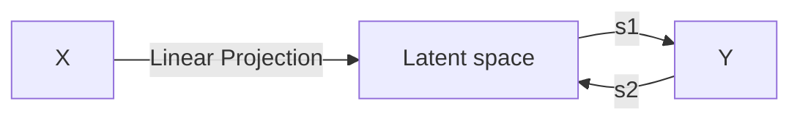
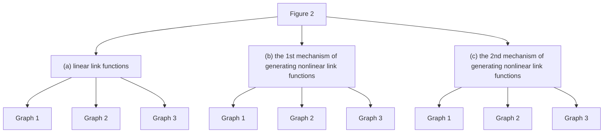

# Nonlinear Multiple Response Regression and Learning of Latent Spaces

Ye Tian,1 Sanyou Wu,2 and Long Feng3

March 28, 2025

## Abstract

Identifying low-dimensional latent structures within high-dimensional data has long been a central topic in the machine learning community, driven by the need for data compression, storage, transmission, and deeper data understanding. Traditional methods, such as principal component analysis (PCA) and autoencoders (AE), operate in an unsupervised manner, ignoring label information even when it is available. In this work, we introduce a unified method capable of learning latent spaces in both unsupervised and supervised settings. We formulate the problem as a nonlinear multiple-response regression within an index model context. By applying the generalized Stein's lemma, the latent space can be estimated without knowing the nonlinear link functions. Our method can be viewed as a nonlinear generalization of PCA. Moreover, unlike AE and other neural network methods that operate as "black boxes", our approach not only offers better interpretability but also reduces computational complexity while providing strong theoretical guarantees. Comprehensive numerical experiments and real data analyses demonstrate the superior performance of our method.

## Key words and phrases

PCA, autoencoder, index model, latent space, Stein's Lemma, SVD.

----

1School of Computing and Data Science, The University of Hong Kong, Pokfulam Road, HKSAR, China
E-mail: ty0518@hku.hk

2School of Computing and Data Science, The University of Hong Kong, Pokfulam Road, HKSAR, China
E-mail: sanyouwsy@gmail.com

3School of Computing and Data Science, The University of Hong Kong, Pokfulam Road, HKSAR, China
E-mail: lfeng@hku.hk

# 1 Introduction

Identifying low-dimensional latent spaces in high-dimensional data has been a longstanding focus in the statistics and machine learning community. This interest is driven not only by the goal of better understanding the data but also by practical applications such as data compression, storage, and transmission.

Principal Component Analysis (PCA, Pearson, 1901) is arguably the simplest and most popular dimension reduction method. PCA and its extensions, such as sparse PCA (Hui Zou and Tibshirani, 2006) and robust PCA (Candes et al., 2009), have found widespread applications in various fields, including computer vision, biomedical analysis, and more. Autoencoders (AE, Vincent et al. 2008) can be viewed as a nonlinear generalization of PCA by replacing simple linear projections with complex nonlinear projections defined by neural networks. With the increasing prevalence of deep learning in recent years, AE and its extensions, such as contractive AE (Rifai et al., 2011) and sparse AE (Makhzani and Frey, 2013), have proven effective in dimension reduction and representation learning.

Despite their significant success, PCA and AE still encounter considerable challenges in learning the latent spaces for downstream tasks. Firstly, both PCA and AE learn the latent space in a purely unsupervised manner. Although the low-dimensional manifold that the high-dimensional features align with reflects their inherent properties, relying solely on this information can be suboptimal when labels are available. Leveraging label information can enhance the quality of the learned latent space, making it more suitable for corresponding downstream tasks. Additionally, PCA is limited to learning the latent space in a linear setting. While autoencoders extend PCA to a nonlinear context, their "black-box" nature not only lacks necessary interpretability but also imposes a significant computational burden.

Rethinking the PCA, if we treat the input as the pseudo output, the data reconstruction problem can be reframed as a multiple response regression with reduced rank coefficients. Multiple response regression in a reduced rank setting has been extensively studied in the literature, although the majority of the work has focused on linear models. Related works include Yuan et al. (2007); Mukherjee and Zhu (2011); Chen et al. (2012); Lu et al. (2012). With a reduced rank setup, dimension reduction can be achieved in multiple response regression, and the latent coefficient

Figure 1: The data we consider could be unlabeled features only, or feature-label pairs, for example, CT and the corresponding diagnoses, or images of suspects and their positions on the surveillance screen, etc. The feature can be linearly embedded in a low-dimensional latent space, and the feature itself and possible labels can be generated from the embeddings through link functions. The goal of the work is to learn the latent space without knowing link functions.

space can be learned. Beyond reduced rank regression, multiple response regression has also been considered under other settings, such as sparse matrix coefficients estimation (Lee and Liu, 2012; Simon et al., 2013; Wang et al., 2013; Changliang Zou and Zhang, 2022). However, as these approaches are limited to linear models, complex nonlinear relationships between predictors and responses can hardly be captured and their applicability in real-world data analyses can be significantly restricted.

In the realm of nonlinear regression, the index model is a prominent statistical framework that extends linear regression to a nonlinear context. Specifically, consider the multi-index model (MIM), where the outcomes are modeled as E(y|x) = f(B⊤x). In this formulation, f represents an unknown nonlinear link function, and the matrix B has a rank significantly smaller than the input dimension. Unlike other statistical methods that introduce nonlinearity, such as generalized linear models or spline regression, MIM inherently produces a latent embedding of the features through the introduction of B. This characteristic is particularly aligned with our objective of estimating the latent space.

Extensive research has been conducted on MIM, particularly on the estimation of the low-rank matrix B. The primary challenge lies in the fact that, without prior knowledge of the link functions, traditional methods such as least squares or maximum likelihood estimators are not applicable for estimating B. Nonetheless, the statistics community has introduced a plethora of innovative solutions over the years. For instance, in low-dimensional settings with fixed rank of B, Friedman and Stuetzle (1981) introduced the projection pursuit regression, under which the link functions and low-rank matrix can be estimated through an alternating optimization process. A series of breakthroughs related to index models are proposed by Ker-Chau Li, including regression under link violation (Li and Duan, 1989), sliced inverse regression (Li, 1991), and principal Hessian directions (Li, 1992). In the high-dimensional setting where the rank of B is allowed to grow with the sample size, the estimation of B is considered under the sparse subspace assumption (Chen et al., 2010; Tan et al., 2018). More recently, a line of research focused on using Stein's method in index models when the distribution of input is known. For example, Yang et al. (2017b) proposed to learn B in a non-Gaussian MIM through a second-order Stein's method. Unlike previous approaches, the Gaussian or elliptically symmetric assumption on the feature is not required in Yang et al. (2017b), thus the application of Stein's method in index models can be significantly broadened. Despite the success of these approaches, we shall note that most of the work concentrates on the scenario with univariate responses. To the best of our knowledge, the application of Stein's method to nonlinear settings with multiple responses has not been thoroughly explored.

In this work, we present a unified method for learning latent spaces in both unsupervised and supervised settings. We address the problem as a nonlinear multiple-response regression within the context of an index model. By leveraging the generalized Stein's lemma, our method estimates the latent space without requiring knowledge of the nonlinear link functions. Our approach can be seen as a nonlinear extension of PCA. Furthermore, unlike neural network methods such as AEs that operate as "black boxes", our framework effectively manages nonlinear models without depending on gradient-based techniques. Consequently, our approach not only offers improved interpretability, but also reduces computational complexity, and provides strong theoretical guarantees. Comprehensive numerical experiments and real data analyses demonstrate the superior performance of our method.

Notations: We use lowercase letters a, b to denote scalars, bold lowercase letters a, b to

denote vectors, bold uppercase letters **A**, **B** to denote matrices. For a matrix **A**, we let ∥**A**∥F denote its Frobenius norm, σi(**A**) denote the i-th largest singular value, SVDl,i(**A**) denote the top-i left singular vectors corresponding to the first i largest singular values, **A**[:, : r] denote the sub-matrix of **A** taking all rows and 1st to r-th columns. For a symmetric matrix **Σ**, let **Σ**† denote its pseudo-inverse, λi(**Σ**) denote the i-th largest absolute values of eigenvalues and Eigeni(**Σ**) denote the rank-i eigenvalue decomposition returning eigenvalues with first i largest absolute values and corresponding top-i eigenvectors or denote the top-i leading eigenvectors only. Let Vp×q denote the set of row or column orthonormal p × q matrices, Vr denote the set of r × r orthogonal matrices. We let N+ denote positive integers. For ∀n ∈ N+, let [n] denote the set {1, . . . , n}. For a random variable x, let ∥x∥∞ = supℓ∈N+{E(xℓ)}1/ℓ denote its L∞-norm. In addition, given two sequences {xn} and {yn}, we denote xn = O(yn), if |xn| ≤ C|yn| for some absolute constant C, denote xn = Ω(yn) if |xn| ≥ C|yn| for some other absolute constant C. We let ∇zf(z) denote the derivative of f(z) w.r.t z and ∇zif(z) the partial derivative w.r.t the i-th element of z.

## 2 Multiple Response Model and PCA

### 2.1 Nonlinear Multiple Response Model

Given an input x ∈ Rp and an output y ∈ Rq, we consider a nonlinear multiple response model:

y = F(**B**⊤x) + ϵ, (2.1)

where ϵ ∈ Rq is a noise vector with zero-mean i.i.d. components ϵ1, . . . , ϵq, **B** ∈ Rp×r is an unknown matrix, and F = (f1, . . . , fq)⊤ is a collection of unknown nonlinear functions with fj : Rr → R. We note that the nonlinear function fj can vary across different outcomes j. Thus, the component-wise formulation of the model (2.1) is given by

yj = fj(**B**⊤x) + ϵj, j ∈ [q]. (2.2)

Without loss of generality, we assume that the matrix **B** has full column rank, meaning rank(**B**) = r. We consider a reduced rank setting where the rank r is significantly smaller than p.

For arbitrary nonlinear functions fj, the coefficient matrix **B** is unidentifiable in model (2.1). For instance, if (F, **B**) is a solution to model (2.1), then (F ◦ **O**-⊤, **BO**) is also a solution for any invertible matrix **O** ∈ Rr×r. Nevertheless, the column space of **B** remains identifiable. Therefore, our goal is to learn the column space of the matrix **B** without knowing the nonlinear functions F.

We shall emphasize that the feature-response pair (x, y) in model (2.1) is general, meaning it can include both real labels ỹ and pseudo labels x, which are the actual input features. When the response vector y corresponds solely to the input features, model (2.1) transitions to the classical unsupervised setup

x = F(**B**⊤x) + ϵ. (2.3)

In this setup, the low-rank matrix **B** serves a role similar to that of the leading principal components in PCA. Specifically, when F is linear, the empirical least squares estimator of **B** in model (2.3) shares the same column space as the leading principal components obtained through PCA.

By allowing the response vector to be general, i.e., y = (x⊤, ỹ⊤)⊤, the column space of **B** can be learned by leveraging information from both the features and the labels. Given that many

real-world applications have limited labeled data, learning B in this semi-supervised manner can be especially advantageous. On the other hand, it is important to recognize that this model essentially assumes that the pseudo output and real output share the same latent space of coefficients. While this assumption might be stringent for certain scenarios, extensive analysis of real data suggests that latent spaces estimated using this semi-supervised approach often outperform those estimated solely from features or limited labels in downstream tasks. For more details, please refer to Section 5.2.

## 2.2 The Stein's Method for Latent Space Estimation

In this subsection, we present two novel approaches for estimating the column space of B, utilizing both first-order and second-order Stein's methods. We begin by introducing Stein's score functions.

**Definition 2.1.** Let x ∈ Rp be a random vector with density P(x). If P(x) is differentiable, the first-order score function, denoted by s(x) : Rp → Rp, is defined as

$$s(x) := -\nabla_x[\ln\{P(x)\}] = -\nabla_xP(x)/P(x).$$  (2.4)

Moreover, let si(x) denote the i-th element of s(x) for i = 1, . . . , p. If P(x) is further twice differentiable, the second-order score function T(x) : Rp → Rp×p is defined as

$$T(x) = \nabla^2_x P(x)/P(x) = s(x)s(x)^\top - \nabla_xs(x).$$ (2.5)

For ∀k, l ∈ [p], let Tk,l(x) denote the k, l-th entry of T(x).

Under Model (2.1), we have the following first-order Stein's lemma.

**Lemma 2.2.** (First-order Stein's Lemma) Suppose model (2.1) holds. Assume that the expectations E{yjs(x)} as well as E{∇zfj(B⊤x)} both exist and well-defined for j ∈ [q]. Further assume that lim∥x∥→∞ fj(B⊤x)P(x) → 0. Then, we have

$$E\{y_j s(x)\} = BE\{\nabla_zf_j(B^\top x)\}.$$ (2.6)

Collectively, equation (2.6) suggests

$$E\{s(x)y^\top\} = BM_1,$$ (2.7)

where M1 = E{∇zf1(B⊤x), . . . , ∇zfq(B⊤x)}.

Lemma 2.2 serves as the cornerstone of our first-order method of learning B. The key point is that by the Stein's lemma, B can be completely split from derivatives of link functions so that we can learn B without knowing their exact formulas. Given n samples {(xi, yi)}ni=1, we propose the following first-order estimator of B:

$$\hat{B} = \text{SVD}_{l,r}\left\{\frac{1}{n}\sum_{i=1}^n s(x_i)y_i^\top\right\}.$$ (2.8)

We summarize our approach in Algorithm 1 below. Note that the score function is required in Algorithm 1. When s(·) is unknown, a plug-in approach can be implemented by replacing the score function with its estimates ŝ(·).

Algorithm 1 First-order Method
Require: Dataset xi ∈ Rp, yi ∈ Rq for i = 1, . . . , n, rank r, score function s(·)
1: Calculate M ← (1/n)∑ni=1 s(xi)yi⊤
2: Perform SVD: (U, Σ, V) ← SVD(M).
3: return top-r left singular vectors, B̂ ← U[:, : r]

Beyond the first-order approach, a second-order Stein's method takes the following form.

Lemma 2.3. (Second-order Stein's Lemma) Suppose model (2.1) holds. Assume that the expectations E{yjT(x)} as well as E{∇2zfj(B⊤x)} both exist and well-defined for j ∈ [q]. Further assume that lim∥x∥→∞ fj(B⊤x)P(x) → 0 and lim∥x∥→∞ ∇zfj(B⊤x)P(x) → 0. Then,

E{yjT(x)} = BE{∇2zfj(B⊤x)}B⊤. (2.9)

Collectively, equation (2.9) suggests

$$E\left\{\frac{1}{q}\sum_{j=1}^q y_jT(x)\right\} = BM_2B^\top,$$ (2.10)

where M2 = E{(1/q)∑qj=1 ∇2zfj(B⊤x)}.

Based on Lemma 2.3, we propose the following second-order estimator:

$$\tilde{B} = \text{Eigen}_r\left\{\frac{1}{nq}\sum_{i=1}^n\sum_{j=1}^q y_{ij}T(x_i)\right\}.$$ (2.11)

We summarize the approach in Algorithm 2 below.

Algorithm 2 Second-order Method
Require: Dataset xi ∈ Rp, yi ∈ Rq for i = 1, . . . , n, rank r, score function T(·)
1: M ← (nq)−1 ∑ni=1 ∑qj=1 yi,jT(xi)
2: Perform rank-r Eigenvalue decomposition:

(U, Σ) ← Eigenr(M)

3: return top-r leading eigenvectors, B̃ ← U

We note that both first-order and second-order approaches are applicable for arbitrary labels y. This implies that our methods can be utilized in both supervised and unsupervised settings. Additionally, in scenarios with limited labeled data, we can estimate B in a semi-supervised manner by making slight adjustments. For instance, consider a situation where there are additional N − n unlabeled samples, denoted as {xi}Ni=n+1, following the same marginal distribution. In such setups, B can be estimated in a semi-supervised manner using the first-order method:

$$\text{SVD}_{l,r}\left\{\frac{1}{n}\sum_{i=1}^n s(x_i)\tilde{y}_i^\top + \frac{1}{N}\sum_{i=1}^N s(x_i)x_i^\top\right\},$$ (2.12)

or the second-order method:

$$
\text{Eigen}_r \left\{\frac{1}{n(q-p)} \sum_{i=1}^n \sum_{j=1}^{q-p} \tilde{y}_{ij}T(x_i) + \frac{1}{Np} \sum_{i=1}^N \sum_{j=1}^p x_{ij}T(x_i)\right\}.
$$

Beyond first and second-order methods, higher-order Stein's methods can also be applied. Related work includes Janzamin et al. (2014); Balasubramanian et al. (2018), although they do not consider multiple response settings. However, it is important to note that higher-order approaches may face additional challenges, such as increased sample size requirements and greater computational complexities. Extensive simulation studies and real data analyses presented in Section 4 and Section 5 indicate that first and second-order methods would be sufficient in practice under general circumstances.

## 2.3 Relationships to Classical Latent Space Learning Methods

We recall the reconstruction task in model (2.3):

$$x = \mathcal{F}(B^\top x) + \epsilon.$$

Under this model setup, when ${x_i}_{i=1}^n$ follows a Gaussian distribution, the following theorem indicates that the column space of $B$ learned using the first-order method is equivalent to that of PCA, even if $\mathcal{F}$ is nonlinear.

**Theorem 2.4.** Assume that model (2.3) holds with ${x_i}_{i=1}^n$ following an i.i.d. Gaussian distribution with zero mean. For any arbitrary link function $\mathcal{F}$, the column space learned from (2.8) matches the column space of the first $r$ leading principal components of $\hat{\Sigma} = (1/n)\sum_{i=1}^n x_ix_i^\top$.

Theorem 2.4 suggests that PCA can be viewed as a special case of the first-order approach with Gaussian design. For other distributions with nonlinear $\mathcal{F}$, our approach offers a general framework for learning the latent space of $B$.

Furthermore, model (2.3) can be seen as a special case of an AutoEncoder, where the encoder is a single linear map and the decoder is a general nonlinear function. With this design, the encoder can be learned directly without needing to know the decoder. By avoiding gradient-descent-based methods for learning $B$, our approach is not only more computationally efficient but also comes with strong theoretical guarantees, as demonstrated in Section 3.

# 3 Theoretical Analysis

In this section, we provide theoretical analyses of both the first-order and second-order approaches. Since only the column space of $B$ can be identified as discussed earlier, we use the following distance measure for two matrices $\Theta_1, \Theta_2 \in \mathbb{R}^{p\times r}$:

$$
\text{dist}(\Theta_1, \Theta_2) = \inf_{V \in \mathcal{V}_r} \|\Theta_1 - \Theta_2V\|_F.
$$

It should be noted that when $r = 1$, this column space distance reduces to the vector distance $\|\Theta_1 - \Theta_2\|_2$ when $\|\Theta_1\|_2 = \|\Theta_2\|_2$. We prove that the learned column space is consistent with the

true column space with the distance (3.1) converging to 0. In the following discussion, when the
context is clear, we denote z as B⊤x and zi as B⊤xi.

## 3.1 Theoretical Guarantees for the First-order Method

To establish the convergence properties, we impose the following assumptions for the first-order
method.

**Assumption 3.1.** Suppose xi ∈ ℝp are i.i.d. observations. For any i ∈ [n], r ∈ [p], assume that
the score sk(xi) is a sub-Gaussian random variable, i.e., supℓ∈ℕ₊ ℓ-1/2[𝔼{|sk(xi)|ℓ}]1/ℓ ≤ C, where
C is a positive constant.

**Assumption 3.2.** Assume that there exists a constant C > 0 such that supℓ∈ℕ₊[𝔼{fj(z)2ℓ}]1/2ℓ ≤
C for all j ∈ [q].

**Assumption 3.3.** For j ∈ [q] and ℓ ∈ [r], assume that 𝔼[∇zℓfj(z)] = Ω(1/√r).

**Assumption 3.4.** Assume that there exists an absolute constant C > 0 such that σr(M1) ≥
C√q/r.

Assumption 3.1 is a relatively mild condition and can be satisfied by a wide range of
distributions, especially when x consists of i.i.d. entries, which is widely adopted in the
literature (Yang et al., 2017a; Balasubramanian et al., 2018). It can be shown that even if x
are independent t, exponential such heavier-tailed distribution, s(x) can still be element-wise sub-
Gaussian. Moreover, it is easy to show that, if x is multivariate normal, s(x) would also be
multivariate normal, therefore, each sk(x), k ∈ [p], would be sub-Gaussian. It is important to note
that we focus on the case of sub-Gaussian scores. Theoretical results for other types of scores, such
as heavy-tailed scores, can be derived using a truncation approach. We omit the details due to
space constraints.

Assumption 3.2 requires that fj(z) are essentially bounded, which would be satisfied when, for
instance, the link functions are bounded, x is bounded or link functions are Lipschitz continuous
and x is sub-Gaussian.

Assumption 3.3 requires that link functions are sensitive enough at the true parameter B under
the distribution x. Assumption 3.4 further requires that the non-zero singular values of M1 are of
the same order.

**Theorem 3.5.** Suppose model (2.1) holds. Under Assumptions 3.1-3.4, the following holds with
probability at least 1 − δ,

$$\inf_{V \in \mathcal{V}_r} \|B - \hat{B}V\|_F = O\left(\sqrt{\frac{rp}{n}}\sqrt{\ln \frac{pq}{\delta}}\right).$$

**Remark 3.6.** For the univariate case with q = r = 1, the L2-convergence rate in Theorem 3.5
reduces to O(√p/n · √ln (p/δ)). It matches the optimal L2-convergence rate O(√p/n) up to a
logarithmic factor. In fact, consider the simplest scenario where f is linear, the L2-convergence
rate of an ordinary least squares estimator of B is √p/n.

Beyond the assumption of known score functions, we extend our analysis to the case with
unknown score functions. Specifically, we assume x follows a Gaussian distribution with mean zero

and an unknown variance Σ. We replace s(·) in equation (2.8) with ŝ(x) obtained by substitute Σ
in s(·) with its moment estimator and let B̌ denote the corresponding estimator of B. To analyze
the properties of B̌, we introduce the following assumption on the link functions.

Assumption 3.7. Suppose the first-order Taylor expansions of the link functions exist and are
denoted as fj(z) = fj(0p×r) + ⟨∇fj(0p×r), z⟩ + hj(z)∥z∥2 with lim∥z∥₂→0 hj(z) = 0, for j ∈ [q].
Assume that the remainder term is bounded, i.e., |hj(zi)| ≤ C for j ∈ [q] and i ∈ [n], where C > 0
is an absolute constant.

The following theorem quantifies the discrepancy in the column space between B̌ and the
original estimator B̂, which is dependent on the true variance Σ.

Theorem 3.8. Suppose model 2.1 holds. Assume that x ∼ N(0, Σ) with λmin(Σ) > 0. Then,
under Assumption 3.7, the following holds with the probability approaching 1:

$$\inf_{V \in \mathcal{V}_r} \|B̂ - B̌V\|_F = O_p\left(\sqrt{\frac{r^2p}{n}}\right).$$

Theorem 3.8 demonstrates that the column space of the plug-in estimator converges to that
of the truth at a rate of O(√(r²p/n)). The effectiveness of this plug-in estimator, B̌, is further
supported by numerical analyses across various distribution types, as illustrated in Section 4.

## 3.2 Theoretical Guarantees for the Second-order Method

Now we prove the theoretical properties of the second-order estimator B̃. We shall consider the
case with sub-exponential second-order scores. To aid in this analysis, we make the following
assumptions.

Assumption 3.9. Assume that Tk,l(x) is sub-exponential for any k,l, i.e.,
sup_{m∈ℕ₊} m⁻¹E{|Tk,l(x)|ᵐ}¹/ᵐ ≤ C for certain constant C.

Assumption 3.10. For j = 1,...,q, assume that sup_{ℓ∈ℕ₊}[E{|fj(z)|ˡ}]¹/ˡ = ∥fj(z)∥∞ ≤ C for
certain constant C > 0.

Assumption 3.11. Assume that sup_{ℓ∈ℕ₊}{E(|ϵ|ˡ)}¹/ˡ ≤ C for certain constant C.

Assumption 3.12. Assume that λr(M₂) ≥ C₁/r for some constant C₁. Further assume that
there exists an absolute constant C₂ > 0, such that ∥1/q ∑ⱼ₌₁ᵠ fj(z)∥∞ > C₂.

Assumptions 3.9 to 3.12 serve as the second-order equivalents to Assumptions 3.1 to 3.4 of the
first-order method. Additional discussions of these assumptions are deferred to Section I.2 in the
Supplement.

Theorem 3.13. Suppose model (2.1) holds. Under Assumptions 3.9 to 3.12, the following holds
for the second-order estimator with probability at least 1 − δ,

$$\inf_{V \in \mathcal{V}_r} \|B - \tilde{B}V\|_F = O\left(\frac{pr}{\sqrt{n}}\sqrt{\ln\left(\frac{p}{\delta}\right)}\right).$$

(3.2)

Theorem 3.13 illustrates the convergence properties of the second-order method. We shall note that the sample size n must be greater than p² to achieve convergence. In contrast, a sample size of n = Ω(p) is sufficient for the first-order method, indicating that higher-order methods require a larger sample size. For the case with unknown score functions, the convergence can be obtained using a method similar to that described for the first-order approach in Section 3.1. The details are omitted due to space limitations.

# 4 Simulation Studies

In this section, we conduct extensive simulation studies to assess the finite sample performances of the proposed estimators in a supervised setup. Unsupervised and semi-supervised settings will be considered in Section 5.

## 4.1 Data Generating Process

We consider a nonlinear model of the following form:

$$y_{i,j} = f_j(B^⊤x_i) + \epsilon_{i,j}, j \in [q], i \in [n].$$

Throughout the experiment, we fix the rank of B to be r and assume that r is known. The matrix B is generated in two steps: first, we generate B_o ∈ R^{p×q}, with entries that are i.i.d. samples from a normal distribution N(μ_o, σ_o²); second, we set B = SVD_{l,r}(B_o). We consider three different multivariate distributions for the input vectors x: multivariate normal distribution N(0, Σ_N), multivariate hyperbolic distribution H_{χ,ψ}(0, Σ_H)¹ and multivariate t-distribution t_ν(0, Σ_t). Furthermore, we assume that the distributions of x are non-degenerate, meaning the dispersion matrices Σ_N, Σ_H, and Σ_t are all positive definite. The random errors ϵ_{i,j} are independently drawn from N(0, σ_ϵ²).

We consider three different mechanisms for generating the link functions. In the first case, we consider linear link functions. Specifically, we let f_j(z) = a_j^⊤z, j ∈ [q].

Then, we investigate two ways of generating nonlinear link functions. We let f_j(z) = a_j^⊤m_j(z), j ∈ [q]², where each m_j(·) represents a certain element-wise nonlinear function, such as sin(x−1) and (x−1)³. In the second case, for the first half of q functions, we select various functions m_1, ..., m_{q/2}. For the second half of q functions, we define m_{q/2+j} as m_{j mod (q/2)} + m_{j mod (q/2)+1}, for j ∈ [q/2].

Finally, we consider a generalized case of the second one. For the first half of q functions, we choose different functions m_1, ..., m_{q/2} as in the second case. For the second half of q functions m_{q/2+j}, j ∈ [q/2], we sample j₁ uniformly from [q/2] and j₂ uniformly from [q/2] \ {j₁}, then we let m_{q/2+j} := m_{j₁} + m_{j₂}.

For details on the parameters and other elementary functions, please refer to Section II.1 of the Supplement.

¹Multivariate hyperbolic distribution is often used in economics, with particular application in the fields of modeling financial markets and risk management. We refer to Section in the Supplement II.2 for more details.

²For simplicity, we suppose q is even.

## 4.2 Performance Comparison

We compare the performance of our approach with that of the reduced rank regression and neural networks, which is evaluated by the distance defined in (3.1) between B and the estimates. To ensure robustness, we report the medians of distances calculated over 100 repetitions, with sample sizes n ranging from 300 to 9000 and the input dimension p fixed at 30. The results from three different mechanisms for generating link functions are plotted in Figure 2.

We note that for linear link functions, $$\sum_{j=1}^q \nabla_z^2 f_j(z) = 0$$ holds, rendering the second-order method inapplicable. Therefore, we only report the performance of the first-order method in this case. We observe that for x following all three distributions, the performances of our first-order method and the reduced rank estimators are very similar. The neural networks perform worse due to model mis-specification.

For nonlinear link functions, our second-order method can achieve better space recovery performance with smaller distances compared to the reduced rank or neural network approach, provided the sample sizes are sufficiently large.

Our first-order method performs similarly to the reduced rank estimator for x ~ N(0, Σ_N) and x ~ H_χ,ψ(0, Σ_H), while outperforms the reduced rank estimator significantly for x ~ t_ν(0, Σ_t) in the second and third cases, indicating that it is robust to the nonlinearity and distribution of x.

The performance of neural network estimators does not consistently improve as sample sizes increase. In the second and third cases, neural networks are mis-specified as our link functions are "independent", while neural networks approximate these functions sharing the same parameters before the final linear layer. As our link functions vary significantly from each other, the approximation cannot be accurate enough, leading to poor estimates of B. In contrast, our methods estimate B without requiring the exact nonlinear format and thus, are more robust than the neural network estimator.

For extended experiments and further discussions, please refer to Section I.5 of Supplement.

## 5 Real Data Analysis

We apply the proposed methods on two real-world datasets. On the MNIST dataset, we assess the finite sample performance of our methods in learning the latent space in model (2.3), i.e., the classical unsupervised setup. On the M1 Patch-seq dataset, we verify our conjecture in Section 2 that the semi-supervised estimator would outperform those estimated solely from features or limited labels especially in the corresponding downstream task.

### 5.1 MNIST Dataset

In this part, we consider the reconstruction task

$$x = F(B^⊤x) + ϵ$$

on MNIST dataset. To make the task harder, we randomly choose n = 10000 samples from the original training set for training and use the full test set for testing.

Since there is no universal metric for evaluating the quality of the estimated latent space when the truth is unknown, we provide the following three metrics. We first consider normalized root squared error (NRSE) and structural similarity index measure (SSIM), which measure the

Figure 2: The figure demonstrates finite sample performances of competing methods when p = 30. From left to right, x ~ N(0, ΣN), Hχ,ψ(0, ΣH) and tν(0, Σt), respectively.

Each graph in rows (a), (b), and (c) shows:

X-axis: Sample Size (1000 to 9000)
Y-axis: Distance

Legend for (a):
- Reduced Rank Regression
- Neural Network
- First Order Stein's Method

Legend for (b) and (c):
- Reduced Rank Regression
- Neural Network
- First Order Stein's Method
- Second Order Stein's Method

Y-axis scale:
(a): 0.0 to 0.3
(b) and (c): 0.1 to 0.9

11

performances of latent embeddings in the reconstruction task. Since these measures incorporate the influence of nonlinear decoders, to eliminate such effects, we also introduce the classification accuracy of the embedding on a multi-class classification task to measure the qualities of the estimated spaces. We compare our methods with baseline methods PCA and AE. For details of definitions of the measures and applications of the methods, please refer to Section I.6 and Section I.7 of the Supplement, respectively.

Figure 3 summarizes the performances of competing methods under three different measures against embedding dimensions h ranging from 10 to 18. To ensure robustness, we report the medians of these metrics over 100 repetitions. As seen in the figure, our methods consistently outperform PCA on NRSE and SSIM for embedding dimensions from 10 to 18, and on classification accuracy from 12 to 18. This is because our methods can capture nonlinear relationships among pixel values, which allows our methods to outperform the best linear approximation.

The AE performs slightly worse than our methods on NRSE and SSIM. Even though it is specifically designed for the reconstruction task, it has more parameters to estimate. Therefore, our methods perform better in cases with smaller sample sizes. For the classification task, the AE ranks last, which is also due to limited samples. Moreover, the latent space learned by the AE is specifically designed for the reconstruction task, while our estimators are task-free.

Comparing our first-order and second-order methods, they perform very close, although the second-order method is slightly inferior. One possible reason is that the multivariate normal assumption used for the second-order scores makes the second-order model mis-specified. Additionally, the relatively small sample size could also affect the performance of the second-order method.

| | | |
| - | - | - |
| !RMSE graph | !SSIM graph | !Classification Accuracy graph |

Figure 3: Comparison of qualities of learned latent spaces of competing methods based on three different metrics. The values are calculated empirically on the testing set and medians over 100 repetitions are reported. From Left to right, the metrics are RMSE, SSIM and classification accuracy, respectively.

## 5.2 M1 Patch-seq Dataset

M1 dataset is one of the largest existing Patch-seq datasets (Scala et al., 2021). It contains n = 1213 neurons from the primary motor cortex of adult mice and spans all types of neurons, both excitatory and inhibitory. Each cell was described by q = 16 electrophysiological properties and we used the p = 1000 most variable genes that were selected in the original publication. We first

performed sequencing depth normalization by converting the counts to counter per million. We
then transformed the data using log₂(x + 1) transformation. Finally, we standardized all gene
expression values and electrophysiological properties to zero mean and unit variance.

We assume the general labels y = (x⊤, ỹ⊤)⊤, where x are most genes and ỹ electrophysiological
properties, satisfy the model:

$$y = F(B⊤x) + ϵ.$$

We separate the samples in the following steps:
1. We randomly select n₁ samples with equal probability as the testing set, which is denoted
as {(xᵢ, ỹᵢ)}ⁿ¹ᵢ₌₁;
2. We randomly choose n₂ samples uniformly from the remaining to be the training set, denoted
as {(xᵢ, ỹᵢ)}ⁿ¹⁺ⁿ²ᵢ₌ₙ₁₊₁;
3. We randomly choose n₃ samples uniformly from the remaining to be the labeled set denoted
by {(xᵢ, ỹᵢ)}ⁿ¹⁺ⁿ²⁺ⁿ³ᵢ₌ₙ₁₊ₙ₂₊₁.

To evaluate the quality of an estimator of B, B‡, since F is unknown, we can first obtain an
estimater of F, F̂, by minimizing ∑ⁿ¹⁺ⁿ²ᵢ₌ₙ₁₊₁ ‖ỹᵢ - F(B‡⊤xᵢ)‖² within a function class. Then, the
quality of B‡ can be evaluated by the prediction mean squared error (PMSE) (1/n₁) ∑ⁿ¹ᵢ₌₁ ‖ỹᵢ -
F̂(B‡⊤xᵢ)‖². We choose F belonging to the linear function class. More complex nonlinear function
classes like those defined by neural networks can also be applied, but due to the limited samples,
they do not perform well. Previous studies (Scala et al., 2021; Kobak et al., 2021) on the dataset
show that linear functions are sufficient.

We consider following variations of our first-order estimator:
1. semi-supervised estimator defined by equation (2.6), estimated on {xᵢ}ⁿᵢ₌ₙ₁₊₁∪{ỹᵢ}ⁿ¹⁺ⁿ²⁺ⁿ³ᵢ₌ₙ₁₊ₙ₂₊₁;
2. supervised estimator defined by equation (2.8) with yᵢ = ỹᵢ, estimated on
{(xᵢ, ỹᵢ)}ⁿ¹⁺ⁿ²⁺ⁿ³ᵢ₌ₙ₁₊ₙ₂₊₁;
3. unsupervised estimator defined by equation (2.8) with yᵢ = xᵢ and estimated on {xᵢ}ⁿᵢ₌ₙ₁₊₁.

To make full use of the limited samples, our semi-supervised design is in a transductive learning
way, i.e., {xᵢ}ⁿ¹⁺ⁿ²ᵢ₌ₙ₁₊₁ is also accessible when estimate B. We also compare our estimators with
PCA estimator. For choices of parameters and applications of competing methods, please refer to
Section 5.2 of the Supplement.

The performances of competing methods are depicted in Figure 4. We plot the medians of PMSE
over 200 repetitions against embedding dimensions h ranging from 4 to 8. The semi-supervised
estimator consistently overwhelms the unsupervised estimator. It would also surpass the supervised
method as the latent dimension increases. The two phenomenon jointly demonstrate that semi-
supervised estimator could overwhelm the ones estimated solely from the feature or limited labels,
respectively, in downstream tasks. Moreover, our unsupervised estimator consistently exceeds the
PCA estimator due to leveraging nonlinear relationship among features.

## 6 Discussion and Future Work

In this paper, we introduced a general framework for learning the latent space within a nonlinear
multiple response model setting. Our approach encompasses PCA as a special case when applied
to Gaussian design. By eschewing gradient-descent-based methods for latent space learning, our
approach is not only computationally more efficient but also offers strong theoretical guarantees.

| PMSE on M1 Patch-seq Dataset | | |
| - | - | - |
| !Chart 1 | !Chart 2 | !Chart 3 |
| n2 = 50 | n2 = 75 | n2 = 100 |

Figure 4: PMSE on M1 Patch-seq Dataset, from left to right, n2 equals to 50, 75 and 100, respectively. From left to right, the label size n2 are 50, 75, 100, respectively.

As a result, downstream tasks such as data compression and data transmission can greatly benefit from this framework.

It is crucial to recognize that Stein's lemmas necessitate knowledge of the score function. When the distribution family is known, we can estimate the unknown parameters, such as the mean and covariances, and employ a plug-in approach. However, in more general settings, accurately estimating the score function for both first-order and second-order methods remains a significant area of research. Additionally, this paper focuses on continuous inputs and outputs. To handle discrete labels, one possible solution is to use approximation methods to convert discrete labels into continuous ones. For instance, in the context of one-hot labels in a multi-class classification problem, the Gumbel-softmax trick can be employed for this conversion. Exploring how Stein's method can be adapted for general discrete scenarios will also be a major focus of our future investigations.

## References

Balasubramanian, K., Fan, J. and Yang, Z. (2018). Tensor methods for additive index models under discordance and heterogeneity. arXiv preprint arXiv:1807.06693 .

Bauer, B. and Kohler, M. (2019). On deep learning as a remedy for the curse of dimensionality in nonparametric regression. The Annals of Statistics 47 2261–2285.

Bauer, F., Pereverzev, S. and Rosasco, L. (2007). On regularization algorithms in learning theory. Journal of complexity 23 52–72.

Breymann, W. and Lüthi, D. (2013). ghyp: A package on generalized hyperbolic distributions. Manual for R Package ghyp .

Candes, E. J., Li, X., Ma, Y. and Wright, J. (2009). Robust principal component analysis? arXiv preprint arXiv: 0912.3599 .

Changliang Zou, Y. K. and Zhang, W. (2022). Estimation of low rank high-dimensional multivariate linear models for multi-response data. Journal of the American Statistical Association 117 693–703.

Chen, K., Dong, H. and Chan, K.-S. (2012). Reduced rank regression via adaptive nuclear norm penalization. arXiv preprint arXiv:1201.0381 .

Chen, X., Zou, C. and Cook, R. D. (2010). Coordinate-independent sparse sufficient dimension reduction and variable selection. The Annals of Statistics 38 3696 – 3723.

Damian, A., Lee, J. and Soltanolkotabi, M. (2022). Neural networks can learn representations with gradient descent. In Conference on Learning Theory.

Friedman, J. H. and Stuetzle, W. (1981). Projection pursuit regression. Journal of the American Statistical Association 76 817–823.

Hui Zou, T. H. and Tibshirani, R. (2006). Sparse principal component analysis. Journal of Computational and Graphical Statistics 15 265–286.

Hyvärinen, A. and Dayan, P. (2005). Estimation of non-normalized statistical models by score matching. Journal of Machine Learning Research 6 695–709.

Janzamin, M., Sedghi, H. and Anandkumar, A. (2014). Score function features for discriminative learning: Matrix and tensor framework. arXiv preprint arXiv:1412.2863 .

Kobak, D., Bernaerts, Y., Weis, M. A., Scala, F., Tolias, A. S. and Berens, P. (2021). Sparse reduced-rank regression for exploratory visualisation of paired multivariate data. Journal of the Royal Statistical Society Series C: Applied Statistics 70 980–1000.

Lee, W. and Liu, Y. (2012). Simultaneous multiple response regression and inverse covariance matrix estimation via penalized gaussian maximum likelihood. Journal of Multivariate Analysis 111 241–255.

Li, K.-C. (1991). Sliced inverse regression for dimension reduction. Journal of the American Statistical Association 86 316–327.

Li, K.-C. (1992). On principal hessian directions for data visualization and dimension reduction: Another application of stein's lemma. Journal of the American Statistical Association 87 1025–1039.

Li, K.-C. and Duan, N. (1989). Regression analysis under link violation. The Annals of Statistics 1009–1052.

Li, Y. and Turner, R. E. (2017). Gradient estimators for implicit models. arXiv preprint arXiv:1705.07107 .

Lu, Z., Monteiro, R. D. and Yuan, M. (2012). Convex optimization methods for dimension reduction and coefficient estimation in multivariate linear regression. Mathematical Programming 131 163–194.

Makhzani, A. and Frey, B. (2013). K-sparse autoencoders. arXiv preprint arXiv:1312.5663 .

Meng, C., Song, Y., Li, W. and Ermon, S. (2021). Estimating high order gradients of the data distribution by denoising. Advances in Neural Information Processing Systems 34 25359–25369.

Mousavi-Hosseini, A., Park, S., Girotti, M., Mitliagkas, I. and Erdogdu, M. A. (2022).
Neural networks efficiently learn low-dimensional representations with sgd. arXiv preprint
arXiv:2209.14863 .

Mukherjee, A. and Zhu, J. (2011). Reduced rank ridge regression and its kernel extensions.
Statistical analysis and data mining: the ASA data science journal 4 612–622.

O'Rourke, S., Vu, V. and Wang, K. (2018). Random perturbation of low rank matrices:
Improving classical bounds. Linear Algebra and its Applications 540 26–59.

Pearson, K. (1901). Liii. on lines and planes of closest fit to systems of points in space. The
London, Edinburgh, and Dublin philosophical magazine and journal of science 2 559–572.

Rifai, S., Vincent, P., Muller, X., Glorot, X. and Bengio, Y. (2011). Contractive auto-
encoders: Explicit invariance during feature extraction. In Proceedings of the 28th international
conference on international conference on machine learning.

Scala, F., Kobak, D., Bernabucci, M., Bernaerts, Y., Cadwell, C. R., Castro, J. R.,
Hartmanis, L., Jiang, X., Laturnus, S., Miranda, E. et al. (2021). Phenotypic variation
of transcriptomic cell types in mouse motor cortex. Nature 598 144–150.

Shi, J., Sun, S. and Zhu, J. (2018). A spectral approach to gradient estimation for implicit
distributions. In International Conference on Machine Learning.

Simon, N., Friedman, J. and Hastie, T. (2013). A blockwise descent algorithm for group-
penalized multiresponse and multinomial regression. arXiv preprint arXiv:1311.6529 .

Song, Y. and Ermon, S. (2019). Generative modeling by estimating gradients of the data
distribution. Advances in neural information processing systems 32.

Song, Y., Garg, S., Shi, J. and Ermon, S. (2020). Sliced score matching: A scalable approach
to density and score estimation. In Uncertainty in Artificial Intelligence.

Strathmann, H., Sejdinovic, D., Livingstone, S., Szabo, Z. and Gretton, A. (2015).
Gradient-free hamiltonian monte carlo with efficient kernel exponential families. Advances in
Neural Information Processing Systems 28 955–963.

Tan, K. M., Wang, Z., Zhang, T., Liu, H. and Cook, R. D. (2018). A convex formulation for
high-dimensional sparse sliced inverse regression. Biometrika 105 769–782.

Vershynin, R. (2018a). High-dimensional probability: An introduction with applications in data
science, vol. 47. Cambridge university press.

Vershynin, R. (2018b). High-dimensional probability: An introduction with applications in data
science, vol. 47. Cambridge university press.

Vincent, P. (2011). A connection between score matching and denoising autoencoders. Neural
computation 23 1661–1674.

Vincent, P., Larochelle, H., Bengio, Y. and Manzagol, P.-A. (2008). Extracting and
composing robust features with denoising autoencoders. In Proceedings of the 25th international
conference on Machine learning.

Wang, W., Liang, Y. and Xing, E. (2013). Block regularized lasso for multivariate multi-response linear regression. In Artificial intelligence and statistics.

Xu, X. (2020). On the perturbation of the moore–penrose inverse of a matrix. Applied Mathematics and Computation 374 124920.

Yang, Z., Balasubramanian, K. and Liu, H. (2017a). High-dimensional non-Gaussian single index models via thresholded score function estimation. In Proceedings of the 34th International Conference on Machine Learning, vol. 70.

Yang, Z., Balasubramanian, K., Wang, Z. and Liu, H. (2017b). Learning non-gaussian multi-index model via second-order stein's method. Advances in Neural Information Processing Systems 30 6097–6106.

Yu, Y., Wang, T. and Samworth, R. J. (2015). A useful variant of the davis–kahan theorem for statisticians. Biometrika 102 315–323.

Yuan, M., Ekici, A., Lu, Z. and Monteiro, R. (2007). Dimension reduction and coefficient estimation in multivariate linear regression. Journal of the Royal Statistical Society Series B: Statistical Methodology 69 329–346.

Zhou, Y., Shi, J. and Zhu, J. (2020). Nonparametric score estimators. In International Conference on Machine Learning.

Supplementary Material for
"Nonlinear Multiple Response Regression and Learning of Latent Spaces"

Ye Tian, Sanyou Wu and Long Feng

# I Some Further Discussions

## I.1 Notations

We introduce some extra notations which would be used in the Supplement. For vector a, let
$$\|a\|_2 = \sqrt{\sum_i a_i^2}$ denote the vector Euclidean norm. For matrix A, let $\|A\|_2 = \sigma_1(A)$$ denote
the spectral norm, and trace(A) denote the trace of A. We let I_k denote the identity matrix
of dimension k. We let vec(·) denote the vectorization operator, vec^(-1)(·) denote its inverse. For
observations of random vectors x_1,...,x_n ∼ x, let var(x) denote its sample variance matrix.

## I.2 Discussion of the Validity of Assumptions in Section 3.2

Assumption 3.9 is in line with Assumption 3.1, since if s(x) is element-wise sub-Gaussian, then the
corresponding T(x) would be element-wise sub-exponential.

Assumption 3.10 is akin to Assumption 3.2, which posits that for all j ∈ [q], f_j(z) is essentially
bounded.

Assumption 3.11 also requires that ϵ is essentially bounded, which could achieved, for example,
by assuming that ϵ follows truncated normal. Both Assumption 3.10 and 3.11 require essential
boundedness. They are technical requirements to facilitate the analyses, and are not difficult to
satisfy in practice when the sample size is finite. It is also demonstrated in our experiments in
Section 4 that even though ϵ or f_j(z) are unbounded, second-order methods also exhibit good
performances in many cases.

Assumption 3.12 naturally follows the fact that the second-order method can work only if M_2 is
full-rank. While more link functions may cause fluctuations in λ_r, at the true value B, λ_r(M_2) still
needs to be lower bounded by some absolute constant independent of q for the second-order method
to work. We assume that λ_r(M_2) = Ω(1/r) to ensure that the total signal level from eigenvalues
can be at least Ω(1). Moreover, $$\|1/q \sum_{j=1}^q f_j(z)\|_\infty > C$$ guarantees that $$1/q \sum_{j=1}^q f_j(z)$$ would not
degenerate to a constant as more link functions are introduced.

## I.3 Score Models

There are two main streams of methods of estimating the first-order score function: one, we call
direct methods is to estimate s(x) directly by minimizing certain measures of difference between
s(x) and its estimator ŝ(x); the other, we call noisy methods, is to estimate some noisy version
of s(x) and hopefully, as noise levels get smaller, we can obtain a good estimator of s(x). The
direct methods can be divided into two categories: parametric methods and non-parametric kernel
methods. We first introduce parametric methods. Let s(x; θ) denote a parametric model of
s(x) parametrized by θ, the score matching method (Hyvärinen and Dayan, 2005) estimates θ
by minimizing the loss function

$$\ell_{sm}(\theta) = \frac{1}{2} \mathbb{E} \left[ \|s(x; \theta) - s(x)\|_2^2 \right],  \qquad (S1a)$$

by applying integral by part, Hyvärinen and Dayan (2005) show that minimizing (S1a) is equivalent to minimize

$$J_{\text{sm}}(\theta) = \mathbb{E}\left[\text{tr}\{\nabla_x s(x;\theta)\} + \frac{1}{2}\|s(x;\theta)\|_2^2\right].$$ (S1b)

Suppose we have observations $x_1,\ldots,x_n \stackrel{i.i.d.}{\sim} \mathbb{P}(x)$, the score matching estimator $\hat{\theta}_{\text{sm}}$ can be obtained by minimizing the empirical version of (S1b), i.e.,

$$\hat{\theta}_{\text{sm}} = \text{argmin}\frac{1}{n}\sum_{i=1}^n\left[\text{tr}\{\nabla_x s(x_i;\theta)\} + \frac{1}{2}\|s(x_i;\theta)\|_2^2\right].$$

Instead of measuring the squared $L_2$-norm between $s(x)$ and its estimator, sliced-score matching (Song et al., 2020) measures the difference by their projections on random directions from certain distributions. Specifically, they consider the loss function

$$\ell_{\text{ssm}}\{\theta, \mathbb{P}(v)\} = \frac{1}{2}\mathbb{E}_v\mathbb{E}_x[v^\top\{s(x;\theta) - v^\top s(x)\}^2],$$ (S2a)

by applying integral by part, Song and Ermon (2019) show that minimizing (S2a) is equivalent to minimize

$$J_{\text{ssm}}\{\theta, \mathbb{P}(v)\} = \mathbb{E}_v\mathbb{E}_x\left[v^\top\{\nabla_x s(x;\theta)\}v + \frac{1}{2}\{v^\top s(x;\theta)\}^2\right]$$ (S2b)

Suppose for each $x_i$, we sample $v_{i1},\ldots,v_{im} \stackrel{i.i.d.}{\sim} \mathbb{P}(v)$, the score matching estimator $\hat{\theta}_{\text{ssm}}$ can be obtained by minimizing the empirical version of (S2b), i.e.,

$$\hat{\theta}_{\text{ssm}} = \text{argmin}\frac{1}{nm}\sum_{i=1}^n\sum_{j=1}^m\left[v_{ij}^\top\{\nabla_x s(x_i;\theta)\}v_{ij} + \frac{1}{2}\{v_{ij}^\top s(x_i;\theta)\}^2\right].$$

In general, $s(x;\theta)$ is chosen be some deep neural network $F_\theta(x) : \mathbb{R}^p \to \mathbb{R}^p$.

Except for parametric models, there is another line of work considering the kernel-based score estimator, and many of these methods can be unified by the following framework(Zhou et al., 2020).

Let $\mathcal{X} \subset \mathbb{R}^p$ denote the support of $x$, $\mathcal{K}$ denote a matrix-valued kernel $\mathcal{K} : \mathcal{X} \times \mathcal{X} \to \mathbb{R}^{p\times p}$ satisfying for any $x, x' \in \mathcal{X}$, $\mathcal{K}(x,x') = \mathcal{K}(x',x)$ and for any $m \in \mathbb{N}_+$, $\{x_i\}_{i=1}^m \subset \mathcal{X}$ and $\{c_i\}_{i=1}^m$, $\sum_{i,j=1}^m c_i^\top\mathcal{K}(x_i, x_j)c_j \geq 0$. We denote a vector-valued reproducing kernel Hilbert space (RKHS) associated to $\mathcal{K}$ by $\mathcal{H}_\mathcal{K}$. Then, the kernel estimator of $s(x)$ can be obtained by solving the regularized vector-valued regression problem

$$\min_{s_r\in\mathcal{H}_\mathcal{K}} \frac{1}{n}\sum_{i=1}^n \|s(x_i) - s_r(x_i)\|_2^2 + R_\lambda(s_r),$$ (S3)

where $R_\lambda(\cdot)$ represents a regularizer belonging to the spectral class of regularization (Bauer et al., 2007) with tuning parameter $\lambda$ corresponding to the estimator of $s(x)$ defined as $g_\lambda(\hat{L}_\mathcal{K})\hat{L}_\mathcal{K}s(x)$, where $\hat{L}_\mathcal{K} = \frac{1}{n}\sum_{i=1}^n \mathcal{K}(x_i,\cdot)$ and $g_\lambda(\hat{L}_\mathcal{K})$ approximate the inverse of operator $\hat{L}_\mathcal{K}$. Note that $\hat{L}_\mathcal{K} : \mathcal{H}_\mathcal{K} \to \mathcal{H}_\mathcal{K}$ is positive semidefinite, suppose it has the eigen decomposition $\hat{L}_\mathcal{K} = \sum_{i=1}^{np} \sigma_i\langle\cdot, U_i\rangle_{\mathcal{H}_\mathcal{K}}U_i$, then $g_\lambda(\hat{L}_\mathcal{K})$ can be represented by $g_\lambda(\hat{L}_\mathcal{K}) = \sum_{i=1}^{np} g_\lambda^\sigma(\sigma_i)\langle\cdot, U_i\rangle_{\mathcal{H}_\mathcal{K}}U_i$, where $g_\lambda^\sigma : \mathbb{R}_+ \to \mathbb{R}$ is a scalar

function. For example, the Tikhonov regularization corresponds to $g_\lambda^\sigma(\sigma) = 1/(\lambda + \sigma)$. In reality, $s(x)$ is unknown, so the solution is infeasible, but by integral by part, Zhou et al. (2020) prove that $\mathcal{L}_Ks(x) = -\mathbb{E}\{div_xK(x, \cdot)^\top\}$, therefore, empirically, we can estimate $s(x)$ by $\hat{s}_r(x) = -g_\lambda(\hat{\mathcal{L}}_K)\hat{\xi}$, where $\hat{\xi} = (1/n)\sum_{i=1}^n div_xK(x_i, \cdot)^\top$. Many kernel score estimators like kernel exponential family estimator (Strathmann et al., 2015), Stein gradient estimator (Li and Turner, 2017), spectral Stein gradient estimator (Shi et al., 2018), etc., can be included in the framework with different choices of the function $g_\lambda^\sigma$ and hypothesis space $\mathcal{H}_K$. For more details please refer to Zhou et al. (2020) and references therein.

All those direct methods mentioned above use integral by parts to avoid the unknown function $s(x)$.

In contrast, noisy methods circumvent the unknown $s(x)$ by estimating a noisy version of $s(x)$. Specifically, denoising score matching (Vincent, 2011) considers the estimator of $\theta$ minimizing the following loss function

$$\mathbb{E}_{(x,\tilde{x})} \left\|s(\tilde{x}; \theta) - \frac{\partial \ln P_\sigma(\tilde{x}|x)}{\partial \tilde{x}}\right\|_2^2,\tag{S4a}$$

where $P_\sigma(\tilde{x}|x)$ is some smooth density estimator with bandwidth $\sigma$, Vincent (2011) prove that under mild conditions minimizing (S4a) is equivalent to minimizing

$$\mathbb{E}_{\tilde{x}} \left\|s(\tilde{x}; \theta) - \frac{\partial \ln P_\sigma(\tilde{x})}{\partial \tilde{x}}\right\|_2^2,$$

where $P_\sigma(\tilde{x}) = (1/n)\sum_{i=1}^n \ln P_\sigma(\tilde{x}|x_i)$. Hopefully, as $\sigma$ gets close to 0, the noisy model $s(x; \hat{\theta}_{dsm})$ would be a good approximation of $s(x)$. Empirically, suppose for each $x_i$, we generate $\tilde{x}_{i,1}, \ldots \tilde{x}_{i,m} \stackrel{i.i.d.}{\sim} P_\sigma(\tilde{x}|x_i)$, then we can get the estimator $\hat{\theta}_{dsm}$ by minimizing the following empirical loss function:

$$\frac{1}{nm}\sum_{i=1}^n \sum_{j=1}^m \left\|s(\tilde{x}_{i,j}; \theta) - \frac{\partial \ln P_\sigma(\tilde{x}_{i,j}|x_i)}{\partial \tilde{x}_{i,j}}\right\|_2^2.$$

$s(x; \theta)$ is also generally chosen to be a deep neural network $F_\theta(x) : \mathbb{R}^p \to \mathbb{R}^p$. Some modifications and extensions were proposed. For example, Song and Ermon (2019) proposed to train the score model using a geometric series of levels of $\sigma$.

Compared with the rapid development of first-order score models due to the prevalence of diffusion models, there is much limited work on second-order score models. For kernel methods, there's no clear function space corresponding to second order gradients; for neural networks, directly taking gradient of first-order score models with respect to predictors not only leads to error accumulation but also in general, cannot generate symmetric output. Moreover, building a neural network for the second-order score also faces up constrains like symmetry, which makes the problem difficult. To the best of our knowledge, Meng et al. (2021) is the only work that propose a deep neural network model for the second-order score function. However, their method needs to estimate a first-order score model at the same time, which leads to error accumulation.

## 1.4 Reduced Rank Estimator, Neural Network Estimator and Ours

The reduced rank regression addresses the following multiple-response linear regression model:

$$y = C^T x + \varepsilon,$$                                                           (S5)

where $C \in \mathbb{R}^{p\times q}$, and $\text{rank}(C) \leq r$ for some $r \leq \min(p,q)$. Let $X$ denote the data matrix $(x_1,\ldots,x_n)^T$ and $Y$ denote the response matrix $(y_1,\ldots,y_n)^T$, reduced rank regression estimates the coefficient matrix $C$ by solving the constrained optimization problem: $\hat{C} = \text{argmin}_{\text{rank}(C)\leq r}\|Y - XC\|^2_F$.

Under low-dimensional setting, i.e., rank($C$) is fixed, it is well known that if $r$ is given, $\hat{C}$ has the closed form (Mukherjee and Zhu, 2011): $\hat{C} = \hat{C}_{\text{ols}}V_rV_r^T$. $\hat{C}_{\text{ols}}$ is the ordinary least squares estimator, i.e., $\hat{C}_{\text{ols}} = \text{argmin}\|Y = XC\|^2_F$. $V_r = \text{SVD}_{l,r}\{(X\hat{C}_{\text{ols}})^T\}$, i.e., the matrix consisting of the first $r$ leading right singular vectors of $X\hat{C}_{\text{ols}}$.

Notably, in our model (2.2), if we additionally require that $r < q$, and $f_j(v) = a_j^T v$ for certain $a_j \in \mathbb{R}^r, j \in [q]$, it reduces to model (S5) with $C = BA$, where $A = (a_1,\ldots,a_q)$. Therefore, model (S5) is a special case of our model (2.2), and $\hat{C}$ can be used for estimating $B$. The reduced rank regression estimator of $B$ is defined as $\hat{B}_R = \text{SVD}_{l,r}(\hat{C})$.

**Remark I.1.** Under the assumption that $x \sim N(0,\Sigma_N)$, and $\Sigma_N$ is non-degenerate, by Lemma IV.1, $s(x) = \Sigma_N^{-1}x$, if we let $\hat{s}(x) = (1/n)(X^TX)^{-1}x$, then $\hat{B} = \text{SVD}_{l,r}(\hat{C}_{\text{ols}})$. The difference between $\hat{B}_R$ and $\hat{B}$ lies in the projection matrix $V_rV_r^T$, which can be seen as the benefit of $\hat{B}_R$ taking advantage of the extra linear information of link functions in model (S5). Results of simulations in Section 4 demonstrate that performances of $\hat{B}$ and $\hat{B}_R$ are almost the same when $x \sim N(0,\Sigma_N)$, the difference above is almost negligible.

The multi-index model has a close relationship with NNs, and many works try to show that NNs can be used to estimate MIM and construct the representation space in the low-dimensional setting (Bauer and Kohler, 2019; Damian et al., 2022; Mousavi-Hosseini et al., 2022). Similarly, for our multi-response extension, the matrix $B$ can also be estimated by NNs. Let $F_\theta(\cdot): \mathbb{R}^r \rightarrow \mathbb{R}^q$ be a neural network parametrized by $\theta$, the neural network estimator $\hat{B}_N$ can be obtained by

$$(\hat{\theta}_N, \hat{B}_N) = \text{argmin}_{(\theta,B)} \frac{1}{n} \sum_{i=1}^n \|y_i - F_\theta(B^T x_i)\|_2^2.$$                                        (S6)

We solve the optimization problem by mini-batch gradient descent. For details of the neural network structure and training procedures, please see Section II.3 of the Supplement.

To apply our method, by densities of $x$, first-order and second-order score functions can be derived in closed forms. Please refer to Section II.4 of Supplement for details. Then, for $x \sim N(0,\Sigma_N)$, parameters are estimated by maximum likelihood estimation. For $x \sim t_\nu(0,\Sigma_t)$ and $x \sim H_{\chi,\psi}(0,\Sigma_H)$, parameters are estimated by a multi-cycle, expectation, conditional estimation algorithm (Breymann and Lüthi, 2013). Then we use the plug-in estimators $\hat{s}(\cdot)$ and $\hat{T}(\cdot)$ to calculate $\hat{B}$ and $\tilde{B}$ defined by equation (2.8) and equation (2.11), respectively.

## I.5 Extended Experiments and Further Discussion

In this subsection, we provide results of experiments on additional choices of p in {50, 80, 100}, and p = 30 in the main paper, which are depicted in Figures S1 to S4. Except results similar to those discussed in Section 4.2, comparing Figures S1 to S4, we see that, while the second-order method tend to overwhelm other methods as the sample size increases, the minimum sample size that it needs to overtake others increases as p increases, which coincides with our analysis of the higher order dependency of its convergence rate on p in Section 3.2.

## I.6 Measures of Qualities of Estimates of Latent Spaces in Section 5

Suppose image data X ∈ ℝ^(c×c) ∼ P(X), we have an encoder E(Z) : ℝ^(c×c) → ℝ^h, and a decoder D(z) : ℝ^h → ℝ^(c×c), where h denotes the embedding dimension. We first consider two metrics measuring (dis-)similarities between the original image X and the recovered image X̃ = D ∘ E(X).

1. We consider the normalized root squared error (NRSE), i.e., E_X(∥X̃ - X∥_F / ∥X∥_F)

2. We also consider the structural similarity index measure (SSIM) between X̃ and X, i.e., E_X{SSIM(X̃, X)}. SSIM calculates the similarity score between two images by comparing their luminance, contrast, and structure; it ranges from -1 to 1 and the larger the SSIM is, the more similar the images are. For the definition of SSIM, please refer to Section III.1.1 of the Supplement for details.

3. Specifically, we consider the classification accuracy defined by:

   E[I{argmax ∘ C_E ∘ E(X) = y}],

   where I(·) is the indicator function and C_E(·) : ℝ^h → ℝ^10 is a multinomial logistic regression model trained on the set [{E(X_i), y_i}]^n_i=1. For details of the model C_E(·), please refer to Section III.1.2 of the Supplement.

## I.7 Application Details of Competing Methods in Section 5

Let B̂_PCA = Eigen_h[var{vec(X)}]. For PCA method, we let the encoder to be E_PCA(X) = B̂^⊤_PCA vec(X) and the decoder to be D_PCA(x) = vec^(-1){B̂_PCA x}.³ We employ fully connected neural networks for AE, encoder E_AE,θ_e(X) and decoder D_AE,θ_d(x), are parametrized by θ_e and θ_d respectively, which can be estimated by minimizing the reconstruction squared error loss. Empirically, (θ̂_e, θ̂_d) is the minimizer of the following loss function:

$$ℓ(θ_e, θ_d) = \frac{1}{n} \sum_{i=1}^n ∥D_{AE,θ_d} ∘ E_{AE,θ_e}(X_i) - X_i∥^2_F.$$

We also use batch-training methods to solve the optimization problem. For details of the structure of the AE and training procedures, please refer to Section III.1.3 of the Supplement.

³Since pixel values of original images are in [0,1], we use the clip function clip(x, α, β) = min{max(x, α), β} to scale the output of the decoder. For fair comparison, we handle the range problem in the same way for all methods, instead of constraining the range of output in the structure of the decoder.

For our first-order estimator, we use the pre-trained score model for MNIST from Song and Ermon (2019) as our first-order score estimator denoted as $\hat{s}(\cdot)^4$. Then the plug-in estimator $\hat{B}$ equals $\text{SVD}_{l,h}[(1/n)\sum_{i=1}^n \text{vec}\{\hat{s}(X_i)\}\{\text{vec}(X_i)\}^\top]$, and our first-order encoder is defined as $\mathcal{E}_{S_f}(X) = \hat{B}^\top \text{vec}(X)$. Our first-order decoder has the same structure as that of the AE, parametrized by $\theta_{S_f}$ and denoted as $\mathcal{D}_{S_f,\theta_{S_f}}(\cdot)$; $\theta_{S_f}$ can also be estimated by minimizing the following empirical mean reconstruction squared error losses on the training set:

$$\ell(\theta_{S_f}) = \frac{1}{n}\sum_{i=1}^n \{\|\mathcal{D}_{S_f,\theta_{S_f}} \circ \mathcal{E}_{S_f}(X_i) - X_i\|_F^2\} \qquad (S8)$$

The decoder is trained in the way similar to that of the AE, please see Section III.1.3 of the Supplement for details.

For our second-order estimator, since there is a lack of trustworthy second-order score models as discussed in Section I.3, we assume pixel values in an vectorized image data follow a multivariate normal distribution and use the estimator of second-order stein's score of multivariate normal distribution introduced in Section II.4 as the second-order score estimator $\hat{T}(\cdot)$. We still use $\tilde{B}$ to denote the second-order plug-in estimator, which equals $\text{SVD}_{l,h}[(1/n/c^2\sum_{i=1}^n \sum_{j=1}^{c^2} \text{vec}(X_i)_j\hat{T}\{\text{vec}(X_i)\}]$, and the second-order encoder is defined as $\mathcal{E}_{S_s}(X) = \tilde{B}^\top \text{vec}(X)$. The second order decoder $\mathcal{D}_{S_s,\theta_{S_s}}(X)$ has the same structure as the first-order decoder and is trained in the same way.

## II Details of Simulations

### II.1 Parameters and Link Functions

Throughout the experiment, we let $q = 20$; $p \in \{30,50,80,100\}$; $n \in \{300,500,1000,3000,5000,7000,9000\}$; $r = 3$; $\mu_o = 0$, $\sigma_o = 1$; $\sigma_\epsilon = 0.5$; $\nu = 10$; $\chi = 2p + 1$, $\psi = p$.

In the first case, we let $a_1,\ldots,a_q \stackrel{i.i.d.}{\sim} \mathcal{N}(0,0.5^2I_r)$; in the second and third case, we let $a_1,\ldots,a_q \stackrel{i.i.d.}{\sim} a$ and elements of $a$ are i.i.d. samples from $|z| + 3$, where $z \sim \mathcal{N}(0,1)$.

We generate $\Sigma_N$, $\Sigma_t$ and $\Sigma_H$ in the following three steps:

1. draw a random orthogonal matrix $Q$ from the $O(p)$ Haar distribution;

2. generate a diagonal matrix $\Lambda_{(\cdot)}$, whose diagonal elements $\Lambda_{i,i} \stackrel{i.i.d.}{\sim} |z| + b_{(\cdot)}$, where $z \sim \mathcal{N}(0,\sigma_{(\cdot)}^2)$;

3. let $\Sigma_{(\cdot)} = Q\Lambda_{(\cdot)}Q^\top$.

We choose $b_N = b_t = b_H = 1$, $\sigma_N = \sigma_t = \sigma_H = 1$.

We use the following elementary nonlinear functions:

1. $m_1 := \sin(x - 1)$
2. $m_2 := \cosh(x - 1)$
3. $m_3 := \cos(x - 1)$

4. $$m_4 := \tanh(x - 1)$$

5. $$m_5 := \arctan(x - 1)$$

6. $$m_6 := (x - 1)^3$$

7. $$m_7 := (x - 1)^5$$

8. $$m_8 := \frac{1}{1 + \exp(-x)}$$

9. $$m_9 := \sqrt{(x - 1)^2 + 1}$$

10. $$m_{10} := \exp(x)$$

## II.2 Multivariate Hyperbolic Distribution

The random vector $x$ is said to have a multivariate generalized hyperbolic distribution if

$$x \stackrel{d}{=} u + w\gamma + \sqrt{w}Az,$$

where $z \sim N(0, I_o)$, $A \in \mathbb{R}^{p\times o}$, $\mu, \gamma \in \mathbb{R}^p$, $w \geq 0$ is a random variable, independent of $z$ and has a Generalized Inverse Gaussian distribution, written as $GIG(\lambda, \chi, \psi)$. The density is

$$f(x) = \frac{(\sqrt{\psi/\chi})^\lambda(\psi + \gamma^\top\Sigma^{-1}\gamma)^{p/2-\lambda}}{(2\pi)^{p/2}|\Sigma|^{1/2}K_\lambda(\sqrt{\chi\psi})} \times \frac{K_{\lambda-p/2}(\sqrt{\{\chi + Q(x)\}(\psi + \gamma^\top\Sigma^{-1}\gamma)}) \exp\{(c - \mu)^\top\Sigma^{-1}\gamma\}}{\{\sqrt{\chi + Q(x)}(\psi + \gamma^\top\Sigma^{-1}\gamma)\}^{p/2-\lambda}},$$

(S1)

where $Q(x) = (x - \mu)^\top\Sigma^{-1}(x - \mu)$, $K_\lambda(\cdot)$ is the modified Bessel function of the third kind. In the experiment, we choose $\lambda = \frac{p+1}{2}$, and fix $\gamma = 0$, $\mu = 0$, which is named multivariate hyperbolic distribution.

## II.3 Structures and Training Details of Neural Networks

For the neural network, we let $\mathcal{F}_\theta(\cdot) = O^\top\phi\{A^\top\phi(\cdot)\}$, where $A \in \mathbb{R}^{r\times h}$, $O \in \mathbb{R}^{h\times q}$, $\phi(\cdot)$ is the point-wise ReLU function and we let $h = 32$. We implement neural networks in Pytorch. For neural network estimator of $B$ discussed in Section I.4, we minimize the loss function

$$\ell(\theta, B) = \frac{1}{n} \sum_{i=1}^n \|y_i - \mathcal{F}_\theta(B^\top x_i)\|_2^2,$$

We use the batch-training strategy to train the neural networks. We use Adam optimizer with Pytorch default parameters. We choose the batch size to be 0.5% of the sample size and train the neural networks for 200 epochs.

## II.4 Score Functions

We assume that the distributions are all non-degenerated, i.e., dispersion matrices are all positive definite. Let $Q_{(\cdot)}(x)$ denote $(x - \mu_{(\cdot)})^\top\Sigma_{(\cdot)}^{-1}(x - \mu_{(\cdot)})$.

1. For $x \sim N(\mu_N, \Sigma_N)$, $P(x) = (2\pi)^{-p/2}|\Sigma_N|^{-1/2} \exp\{-1/2 \cdot Q_N(x)\}$.

   $$s(x) = -\nabla_x \ln\{P(x)\} = \frac{1}{2}\nabla_x\{Q_N(x) + p \ln (2\pi) + \ln(|\Sigma_N|)\} = \Sigma_N^{-1}(x - \mu_N).$$

   $$T(x) = s(x)s(x)^\top - \nabla_xs(x) = \Sigma_N^{-1}(x - \mu_N)(x - \mu_N)^\top\Sigma_N^{-1} - \Sigma_N^{-1}.$$

2. For $x \sim t_\nu(\mu_t, \Sigma_t)$, $\nu \geq 2$, $P(x) = (\nu - 2)^{\nu/2}\Gamma\{(\nu + p)/2\}/\pi^{p/2}/|\Sigma_t|^{1/2}/\Gamma(\nu/2)/\{\nu - 2 + Q_t(x)\}^{(\nu+p)/2}$.

   $$s(x) = - \nabla_x \ln\{P(x)\}$$
   
   $$=\nabla_x \left(\frac{\nu + p}{2} \ln \{\nu - 2 + Q_t(x)\} - \ln \left[\frac{(\nu - 2)^{\nu/2}\Gamma\{(\nu + p)/2\}}{\Gamma(\nu/2)\pi^{p/2}|\Sigma_t|^{1/2}}\right]\right)$$
   
   $$=\frac{(p + \nu)\Sigma_t^{-1}(x - \mu_t)}{\nu - 2 + Q_t(x)}.$$

   $$T(x) =s(x)s(x)^\top - \nabla_xs(x)$$
   
   $$=\frac{(p + \nu)(p + \nu + 2)\Sigma_t^{-1}(x - \mu_t)(x - \mu_t)^\top\Sigma_t^{-1} - (p + \nu)\{\nu - 2 + Q_t(x)\}\Sigma_t^{-1}}{\{\nu - 2 + Q_t(x)\}^2}.$$

3. For $x \sim H_{\chi,\psi}$,

   $$P(x) = \frac{(\psi/\chi)^{(p+1)/2}}{(2\pi)^{p/2}|\Sigma|^{1/2}(\psi)^{1/2}K_{1/2}(\sqrt{\chi\psi})} \times K_{1/2}(\sqrt{\{\chi + Q(x)\}\psi}[\sqrt{\{\chi + Q(x)\}\psi}]^{1/2},$$

   where $K_{1/2}(x) = \sqrt{\pi/(2x)} \exp(-x)$.

   $$s(x) = - \nabla_x \ln\{P(x)\} = \nabla_x\sqrt{\{\chi + Q_H(x)\}\psi} = \frac{\psi^{1/2}\Sigma_H^{-1}(x - \mu_H)}{\sqrt{\{\chi + Q_H(x)\}}}.$$

   $$T(x) =s(x)s(x)^\top - \nabla_xs(x)$$
   
   $$=\frac{\{\psi + \psi^{1/2}/\sqrt{\chi + Q_H(x)}\}\Sigma_H^{-1}(x - \mu_H)(x - \mu_H)^\top\Sigma_H^{-1} - \psi^{1/2}\sqrt{\chi + Q_H(x)}\Sigma_H^{-1}}{\{\chi + Q_H(x)\}}$$

## III Details of Real Data Analysis

### III.1 Details on MNIST Dataset

#### III.1.1 Structural Similarity Index Measure

Given two images X and Y,

$$\text{SSIM} := \frac{(2\mu_x\mu_y + c_1)(2\sigma_{xy} + c_2)}{(\mu_x^2 + \mu_y^2 + c_2)(\sigma_x^2 + \sigma_y^2 + c_2)},  \tag{S1}$$

where $(\mu_x, \mu_y)$ and $(\sigma_x, \sigma_y)$ are means and variances of pixel values of X and Y respectively, $\sigma_{xy}$ is the covariance of pixel values of X and Y, $c_1 = (0.01R)^2$, $c_2 = (0.03R)^2$, where R denotes the range of pixel values in the image.

## III.1.2 Structure and Training Details of $C_E(\cdot)$

$C_E(\cdot)$ is a one layer neural network composed with softmax function, i.e., $C_E(z) = \text{softmax}(W_E^⊤z + b_E)$, where $W_E \in \mathbb{R}^{h\times10}$ and $b_E \in \mathbb{R}^{10}$ are the weight matrix and bias vector corresponding to the encoder, respectively, which are estimated by minimizing the following loss function:

$$\ell(W_E, b_E) = \mathbb{E}[\|\text{softmax}\{W_E^⊤\mathcal{E}(X) + b_E\} - y^‡\|_2^2],$$

where $y^‡$ is the one-hot encoding of $y$. We use the batch-training strategy to train the neural network. We use Adam optimizer with Pytorch default parameters. We choose the batch size to be 128 and we train the neural network for 50 epochs.

## III.1.3 Structure and Training Details of Autoencoder

Table S1 demonstrates the structure of the AE we use. The same decoder structure is also used for our method. To estimate the parameters of AE $(θ_e, θ_d)$, we minimize the loss function (S7); and to estimate the parameters of decoders of our methods, we minimize the loss functions (S8). For both AE and our methods, we use the batch-training strategy to train the neural network. We use Adam optimizer with Pytorch default parameters. We choose the batch size to be 128 and we train the neural network for 50 epochs.

Table S1: Structure of the Autoencoder

| | Layer | Type |
| - | - | - |
| Encoder | 1 | fully connected layer (in dims = 784, out dims = 4h) |
| | 2 | ReLU |
| | 3 | fully connected layer (in dims = 4h, out dims = 2h) |
| | 4 | ReLU |
| | 5 | fully connected layer (in dims = 2h, out dims = h) |
| Decoder | 1 | fully connected layer (in dims = h, out dims = 2h) |
| | 2 | ReLU |
| | 3 | fully connected layer (in dims = 2h, out dims = 4h) |
| | 4 | ReLU |
| | 5 | fully connected layer (in dims = 4h, out dims = 784) |

## III.1.4 Comparison of Performances of Competing Methods

We provide Figure S5, the enlarged version of Figure 3 in Section 5, in the main paper.

## III.2 Details on M1 Patch-seq Dataset

We choose $n_1 = 213$, $n_2 \in \{50, 75, 100\}$, to make fair comparison for different $n_2$, we let $n_3 = 900$.
To imply our first-order method, we use the $\nu$-method introduced in Zhou et al. (2020) as our score estimator $\hat{s}(\cdot)$. We let $\lambda = e^{-5}$ and use the curl-free version of IMQ kernel.
We calculate the PCA estimator on $(x_{n_1+1}, \ldots, x_n)$.
We provide Figure S6, the enlarged version of Figure 4 in Section III.2, in the main paper.

# IV Proofs of Main Results

## IV.1 Proofs of Stein's Lemmas

### IV.1.1 Proof of Lemma 2.2

Proof. For ∀i ∈ [p], j ∈ [q],

$$E\{y_j s_i(x)\} = E[\{f_j(B^\top x) + \epsilon_j\}s_i(x)] = E\{f_j(B^\top x)s_i(x)\} + E\{\epsilon_j s_i(x)\} = E\{f_j (B^\top x)s_i(x)\}$$

$$= - \int_{\mathbb{R}^p} f_j(B^\top x)s_i(x)P(x)dmx = - \int_{\mathbb{R}^p} f_j (B^\top x)\nabla_{x_i}P(x)dmx$$

$$= \int_{\mathbb{R}^p} \nabla_{x_i}f_j(B^\top x)P(x)dmx - \Delta$$

$$=b_i^\top E[\nabla_z\{f_j (B^\top x)\}],$$

where $b_i$ is the i-th column of $B^\top$ and

$$\Delta = \int_{\mathbb{R}^{p-1}} \{ \lim_{a \to \infty} f_j(B^\top x)P(x)|_{x=(x_1,...,x_{i-1},a,x_{i+1},...,x_p)} - \lim_{b \to -\infty} f_j(B^\top x)P(x)|_{x=(x_1,...,x_{i-1},b,x_{i+1},...,x_p)} \}$$

$$d(x_1, \ldots, x_{i-1}, x_{i+1}, \ldots, x_p) = 0.$$

Stacking $E\{s_i(x)y_j\}$, $i \in [p]$ together, we have $E\{y_j s(x)\} = BE[\nabla_z\{f_j(B^\top x)\}]$.

□

### IV.1.2 Proof of Lemma 2.3

Proof. For ∀j ∈ [q]; k, l ∈ [p],

$$E\{y_jT_{k,l}(x)\} = E\{f_j(B^\top x)T_{k,l}(x)\} = E \left(\frac{f_j(B^\top x)}{P(x)}\nabla^2_{x_k,x_l}P(x)\right)$$

$$= \int_{\mathbb{R}^p} \left\{f_j(B^\top x)\nabla^2_{x_k,x_l}P(x)\right\} dmx = - \int_{\mathbb{R}^p} \left\{\nabla_{x_k}f_j(B^\top x)\nabla_{x_l}P(x)\right\} dmx + \Delta_1$$

$$= - \int_{\mathbb{R}^p} \left\{\nabla_{x_k}f_j(B^\top x)\nabla_{x_l}P(x)\right\} dmx = -b_k^\top \int_{\mathbb{R}^p} \left\{\nabla_zf_j(B^\top x)\nabla_{x_k}f_j(B^\top x)\right\} dmx$$

$$= - b_k^\top \Delta_2 + b_k^\top \int_{\mathbb{R}^p} \left[P(x)\nabla_{x_l}\{\nabla_zf_j(B^\top x)\}\right] dmx$$

$$=b_k^\top \int_{\mathbb{R}^p} \left[P(x)\nabla_{x_l}\{\nabla_zf_j(B^\top x)\}\right] dmx = b_k^\top \int_{\mathbb{R}^p} \left\{P(x)\nabla^2_zf_j(B^\top x)\right\} dmxb_l$$

$$=b_k^\top E\{\nabla^2_zf_j(B^\top x)\}b_l,$$

where $b_k$ and $b_l$ are the k-th and l-th columns of $B^\top$.

$$\Delta_1 = \int_{\mathbb{R}^{p-1}} \left[ \lim_{a \to +\infty} \{f_j(B^\top x)\nabla_{x_l}P(x)\}|_{x_1,...,x_{k-1},a,x_{k+1},...,x_p} - \lim_{b \to -\infty} \{f_j(B^\top x)\nabla_{x_l}P(x)\}|_{x_1,...,x_{k-1},b,x_{k+1},...,x_p} \right]$$

$$d(x_1, \ldots, x_{k-1}, x_{k+1}, \ldots, x_p) = 0,$$

and Δ₂ is an r-dimensional vector, the i-th element of which is

$$
\int_{\mathbb{R}^{p-1}} \left[ \lim_{a\to+\infty} \{\nabla_{z_i}f_j(B^T x)P(x)\}|_{x_1,...,x_{l-1},a,x_{l+1},...,x_p} - \lim_{b\to-\infty} \{\nabla_{z_i}f_j(B^T x)P(x)\}|_{x_1,...,x_{l-1},b,x_{l+1},...,x_p} \right]
$$

d(x₁, ..., x_{l-1}, x_{l+1}, ..., x_p) = 0.

Stacking all E{y_jT_{k,l}(x)}, k,l ∈ [p] together, we have E{y_jT(x)} = BE{∇²_z f_j(B^T x)}B^T.

## IV.2 Proofs of the First-order Method

In the following proofs, absolute constants C₁ to C₄ are from Assumptions 3.1, 3.2, 3.4, and 3.7, respectively.

We will use the following simple lemma without proof.

**Lemma IV.1.** Suppose x ∼ N(0, Σ), the first-order score function has the form s(x) = Σ†x.

Empirically, if we have observations x₁, ..., x_n ∼ N(0, Σ), denote the sample variance matrix Σ̂ = 1/n ∑ᵢ₌₁ⁿ xᵢxᵢ^T, then, the plug-in estimator of s(xᵢ) can be ŝ(xᵢ) = Σ̂†xᵢ.

### IV.2.1 Proof of Theorem 2.4

Based on Lemma IV.1, we prove Theorem 2.4.

**Proof.** Let Σ̂ = (1/n) ∑ᵢ₌₁ⁿ xᵢxᵢ^T. Notice that in the statement of the theorem, by "the column space learned from equation (2.8)", we refer to the case where Σ is unknown and replaced by Σ̂, so that ŝ(x) = Σ̂†x. We assume that Σ̂ has the eigenvalue decomposition Σ̂ = UΛ̃U^T, where

$$
\tilde{\Lambda} = \begin{pmatrix} \Lambda & 0 \end{pmatrix},
$$

Λ is a diagonal and invertible matrix. By equation (2.8) and Lemma IV.1, we have

$$
\hat{B} = \text{SVD}_{l,r}\left\{\frac{1}{n}\sum_{i=1}^n s(x_i)y_i^T\right\} = \text{SVD}_{l,r}\left\{\hat{\Sigma}^\dagger\hat{\Sigma}\right\} = \text{SVD}_{l,r}\left\{U\begin{pmatrix}I_p & 0\end{pmatrix}U^T\right\} = U[:, :r],
$$

which means that columns of B̂ consist of first r leading principal components of Σ̂.

### IV.2.2 Proof of Theorem 3.5

We first prove a lemma that establishes a bound on the moment of a Gaussian random variable.

**Lemma IV.2.** If random variable z ∼ N(0, σ²), then [E|z|ˡ]¹/ˡ ≤ σ√l for l ≥ 1.

**Proof.** The l-th moment of z can be expressed as follows

$$
E|z|^l = \int_{\mathbb{R}} |z|^l \frac{1}{\sqrt{2\pi\sigma}} \exp\left(-\frac{z^2}{2\sigma^2}\right) dz
$$

$$
= 2 \int_0^{\infty} z^l \frac{1}{\sqrt{2\pi\sigma}} \exp\left(-\frac{z^2}{2\sigma^2}\right) dz
$$

11

$$(i) 2 \int_0^{\infty} \frac{1}{\sqrt{2\pi\sigma}}(\sqrt{2t\sigma})^{\ell} e^{-t} \cdot \frac{\sqrt{2\sigma}}{2\sqrt{t}} dt$$

$$= \frac{(\sqrt{2\sigma})^{\ell}}{\sqrt{\pi}} \cdot \int_0^{\infty} t^{\frac{\ell-1}{2}} e^{-t} dt$$

$$(ii) = \frac{(\sqrt{2\sigma})^{\ell}}{\sqrt{\pi}} \cdot \Gamma\left(\frac{\ell + 1}{2}\right),$$

where (i) is by the transformation $z = \sqrt{2t\sigma}$, (ii) is by $\Gamma(x) = \int_0^{\infty} t^{x-1}e^{-t}dt$. If $\ell$ is even, then we have,

$$\frac{(\sqrt{2\sigma})^{\ell}}{\sqrt{\pi}} \cdot \Gamma\left(\frac{\ell + 1}{2}\right) = \frac{(\sqrt{2\sigma})^{\ell}}{\sqrt{\pi}} \cdot \frac{\ell - 1}{2} \cdot \frac{\ell - 3}{2} \cdot ... \cdot \frac{1}{2} \cdot \Gamma\left(\frac{1}{2}\right) \leq \frac{(\sqrt{2\sigma})^{\ell}}{\sqrt{\pi}} \cdot \frac{\sqrt{\ell!}}{2^{\ell/2}} \cdot \sqrt{\pi} = \sigma^{\ell}\sqrt{\ell!}.$$

On the other hand, if $\ell$ is odd, then we get

$$\frac{(\sqrt{2\sigma})^{\ell}}{\sqrt{\pi}} \cdot \Gamma\left(\frac{\ell + 1}{2}\right) = \frac{(\sqrt{2\sigma})^{\ell}}{\sqrt{\pi}} \cdot \frac{\ell - 1}{2} \cdot \frac{\ell - 3}{2} \cdot ... \cdot 1 \cdot \Gamma(1) \leq \frac{(\sqrt{2\sigma})^{\ell}}{\sqrt{\pi}} \cdot \frac{\sqrt{\ell!}}{2^{(\ell-1)/2}} \leq \sigma^{\ell}\sqrt{\ell!}.$$

In summary, we arrive at

$$[\mathbb{E}|z|^{\ell}]^{\frac{1}{\ell}} \leq (\sigma^{\ell}\sqrt{\ell!})^{\frac{1}{\ell}} \leq \sigma\sqrt{\ell}.$$

Then, we can obtain the following concentration property of $s(x)y^{\top}$.

## Lemma IV.3. 
Suppose model (2.1) holds, under Assumptions 3.1 to 3.3, with probability at least $1 - \delta$,

$$\left\|\frac{1}{n}\sum_{i=1}^n s(x_i)y_i^{\top} - \mathbb{E}[s(x)y^{\top}]\right\|_F = O\left(\sqrt{\frac{pq}{n}}\sqrt{\ln\frac{pq}{\delta}}\right).$$

Proof. We first prove that $y_js_k(x) - \mathbb{E}y_js_k(x)$ follows the sub-exponential distribution. For simplicity, we denote $y := y_j$, $s = s_k(x)$, $\epsilon := \epsilon_j$ and $f := f_j(B^{\top}x)$. Then for $\ell \geq 1$, we have

$$[\mathbb{E}|ys - \mathbb{E}(ys)|^{\ell}]^{\frac{1}{\ell}} \stackrel{(i)}{=} [\mathbb{E}|(f + \epsilon)s - \mathbb{E}(fs)|^{\ell}]^{\frac{1}{\ell}}$$
$$\stackrel{(ii)}{\leq} [\mathbb{E}|fs|^{\ell}]^{\frac{1}{\ell}} + [\mathbb{E}|\epsilon s|^{\ell}]^{\frac{1}{\ell}} + |\mathbb{E}(fs)|$$
$$\stackrel{(iii)}{\leq} [\mathbb{E}|f|^{2\ell}]^{\frac{1}{2\ell}} \cdot [\mathbb{E}|s|^{2\ell}]^{\frac{1}{2\ell}} + [\mathbb{E}|\epsilon|^{\ell}]^{\frac{1}{\ell}} \cdot [\mathbb{E}|s|^{\ell}]^{\frac{1}{\ell}} + [\mathbb{E}|f|^2]^{\frac{1}{2}} \cdot [\mathbb{E}|s|^2]^{\frac{1}{2}}$$
$$\stackrel{(iv)}{\leq} C_2 \cdot C_1\sqrt{2\ell} + \sigma_{\epsilon}\sqrt{\ell} \cdot C_1\sqrt{\ell} + C_2 \cdot C_1\sqrt{2}$$
$$\stackrel{(v)}{\leq} 3C_1C_2\ell + \sigma_{\epsilon}C_1\ell$$
$$= (3C_2 + \sigma_{\epsilon})C_1\ell$$

where (i) is by independent, (ii) is by Minkowski's inequality. (iii) holds by Cauchy-Schwarz inequality and (iv) is by the Assumption 3.1, 3.2 and Lemma IV.2. In addition, (v) holds since

that ℓ ≥ 1.
Therefore, each element of s(x)y⊤ follows the sub-exponential distribution. Hence, by the properties of sub-exponential, we have

$$\|ys - E(ys)\|_{\psi_1} = \sup_{ℓ≥1} \frac{1}{ℓ}[E|ys - E(ys)|^ℓ]^{\frac{1}{ℓ}} \leq (3C_2 + \sigma_\epsilon)C_1$$

On the other hand, according to Bernstein's inequality, for any t > 0, we have

$$P\left(\left|\frac{1}{n}\sum_{i=1}^n y_is_i - E(ys)\right| \geq t\right) \leq 2 \cdot \exp\left(-cn \min\left(\frac{t^2}{K^2}, \frac{t}{K}\right)\right)$$

where K ≤ (3C₂ + σ_ε)C₁ and c > 0 is an absolute constant. Recall that the above provides a tail bound for the (j, r)-th element of s(x)y⊤. Next, we consider the tail bound for the entire matrix s(x)y⊤ as follows

$$P\left[\left\|\frac{1}{n}\sum_{i=1}^n s(x_i)y_i^⊤ - E\{s(x)y^⊤\}\right\|_F / \sqrt{pq} \geq t\right]$$

$$\leq \sum_{j=1}^q \sum_{r=1}^p P\left(\left|\frac{1}{n}\sum_{i=1}^n y_is_i - E(ys)\right| \geq t\right)$$

$$\leq 2pq \cdot \exp\left(-cn \min\left(\frac{t^2}{K^2}, \frac{t}{K}\right)\right)$$

Letting t = (3C₂ + σ_ε)C₁ · √ln(2pq/δ)/√cn, we get

$$P\left[\left\|\frac{1}{n}\sum_{i=1}^n s(x_i)y_i^⊤ - E\{s(x)y^⊤\}\right\|_F \geq \sqrt{\frac{pq}{cn}}(3C_2 + \sigma_\epsilon)C_1\sqrt{\ln\frac{2pq}{\delta}}\right] \leq \delta$$

Therefore, with probability at least 1 - δ, we have

$$\left\|\frac{1}{n}\sum_{i=1}^n s(x_i)y_i^⊤ - E\{s(x)y^⊤\}\right\|_F = O\left(\sqrt{\frac{pq}{n}}\sqrt{\ln\frac{pq}{\delta}}\right).$$

We are now prepared to prove the main theory on the first order estimator B̂, as defined in equation (2.8).

Proof of Theorem 3.5. According to the result of Lemma IV.3, with probability at least 1 - δ, we have

$$\left\|\frac{1}{n}\sum_{i=1}^n s(x_i)y_i^⊤ - E\{s(x)y^⊤\}\right\|_F = O\left(\sqrt{\frac{pq}{n}}\sqrt{\ln\frac{pq}{\delta}}\right).$$

Next, by the Theorem 2 in Yu et al. (2015) and Theorem 19 in O'Rourke et al. (2018), there exists

13

an orthogonal matrix $\hat{V} \in \mathbb{R}^{r\times r}$, such that

$$\|B - B\hat{V}\|_F \leq 2^{\frac{3}{2}} \cdot \frac{\|\frac{1}{n}\sum_{i=1}^n s(x_i)y_i^\top - \mathbb{E}\{s(x)y^\top\}\|_F}{\sigma_r(M_1)}$$

$$= O\left(\sqrt{\frac{rp}{n}}\sqrt{\ln\frac{pq}{\delta}}\right),$$

where the last equality holds by Assumption 3.3.

## IV.2.3 Proof of Theorem 3.8

To begin, we present three lemmas that will be used in the subsequent proofs.

**Lemma IV.4.** ( Vershynin 2018a, Covariance estimation). Let $X$ be an $n \times p$ matrix whose rows $x_i$ are independent, mean zero, sub-Gaussian random vectors in $\mathbb{R}^p$ with the same covariance matrix $\Sigma$. Denote $\hat{\Sigma} = (1/n)X^\top X$ as the sample covariance matrix. Then for any $t \geq 0$, with probability at least $1 - 2\exp(-t^2p)$, we have

$$\|\hat{\Sigma} - \Sigma\|_2 \leq \max(\delta, \delta^2),$$

where $\delta = CLt\sqrt{p/n}$, $L = \max(K, K^2)$ and $K = \max_i \|x_i\|_{\psi_2}$.

**Lemma IV.5.** (Vershynin 2018a, Random matrices with general rows) Let $X$ be an $n \times p$ matrix whose rows $x_i$ are independent isotropic random vectors in $\mathbb{R}^p$. Assume that for some $L \geq 0$, it holds almost surely for every $i$ that $\|x_i\|_2 \leq L\sqrt{p}$. Then for every $t \geq 0$, one has with probability at least $1 - 2p \cdot \exp(-ct^2)$,

$$\sqrt{n} - tL\sqrt{p} \leq \sigma_{\min}(X) \leq \sigma_{\max}(X) \leq \sqrt{n} + tL\sqrt{p},$$

where $\sigma_{\min}(X)$ and $\sigma_{\max}(X)$ are the smallest and largest singular values of $X$, respectively.

**Lemma IV.6.** (Xu 2020, Perturbation of inverse) For two matrices $W, Q \in \mathbb{R}^{p\times p}$, we have

$$\|W^{-1} - Q^{-1}\|_2 \leq \|W\|_2\|Q\|_2 \|W - Q\|_2.$$

**Lemma IV.7.** Let $x \in \mathbb{R}^p$ be a sub-Gaussian random vector with parameter $\sigma$, then with probability at least $1 - t$ for $t \in (0, 1)$,

$$\|x\|_2 \leq 4\sigma\sqrt{p} + 2\sigma\sqrt{\ln(1/t)}.$$

**Proof of Theorem 3.8.** According to Taylor's theorem, $f_j(B^\top x)$ can be expanded at the point $a = 0_r$ as follows with a function $h_j : \mathbb{R}^r \to \mathbb{R}$

$$f_j(B^\top x) = \langle\nabla f_j(0_r), B^\top x\rangle + h_j(B^\top x)\|B^\top x\|_2$$
$$= x^\top B\nabla f_j(0_r)^\top + h_j(B^\top x)\|B^\top x\|_2,$$

with $\lim_{B^\top x\to 0_r} h_j(Bx) = 0$ for all $j \in [q]$. Hence, we arrive at

$$F(B^\top x)^\top = x^\top B \cdot \nabla F(0_r)^\top + H(B^\top x)^\top\|B^\top x\|_2,$$

14

where $$\nabla F(0_r) := \{\nabla f_1(0_r), \ldots, \nabla f_q(0_r)\}^\top \in \mathbb{R}^{q\times r}$$ and $$H\{B^\top x) := (h_1(Bx), \ldots, h_q(Bx))^\top \in \mathbb{R}^q$$. Therefore, we have

$$\frac{1}{n}\sum_{i=1}^n s(x_i)y_i^\top = \frac{1}{n}\sum_{i=1}^n s(x_i)x_i^\top B \cdot \nabla F(0_r)^\top + \frac{1}{n}\sum_{i=1}^n s(x_i) \left(\epsilon_i^\top + H(B^\top x_i)^\top \|B^\top x_i\|_2\right).$$

For Gaussian distribution with zero mean and covariance matrix $$\Sigma$$, we have the score of $$x$$ is $$s(x) = \Sigma^\dagger x$$. Denote $$\hat{\Sigma} := (1/n)\sum_{i=1}^n x_ix_i^\top$$. Thus, if the covariance matrix is unknown, i.e., the $$\Sigma$$ replaced by $$\hat{\Sigma}$$, we then have

$$\left\|\frac{1}{n}\sum_{i=1}^n s(x_i)y_i^\top - \frac{1}{n}\sum_{i=1}^n \hat{s}(x_i)y_i^\top\right\|_F$$

$$= \left\|\frac{1}{n}\sum_{i=1}^n(\Sigma^\dagger - \hat{\Sigma}^\dagger)x_ix_i^\top B \cdot \nabla F(0_r)^\top + \frac{1}{n}\sum_{i=1}^n(\Sigma^\dagger - \hat{\Sigma}^\dagger)x_i \left(\epsilon_i^\top + H(B^\top x_i)^\top \|B^\top x_i\|_2\right)\right\|_F$$

$$\leq \|(\Sigma^\dagger\hat{\Sigma} - I_p)B \cdot \nabla F(0_r)^\top\|_F + \frac{1}{n}\|(\Sigma^\dagger - \hat{\Sigma}^\dagger)\sum_{i=1}^n \left(x_i\epsilon_i^\top + x_iH(B^\top x_i)^\top \|B^\top x_i\|_2\right)\|_F$$

$$\leq \underbrace{\|(\Sigma^\dagger\hat{\Sigma} - I_p)\|_F \cdot \|B \cdot \nabla F(0_r)^\top\|_F}_{T_1} + \frac{1}{n}\|(\Sigma^\dagger - \hat{\Sigma}^\dagger)\|_F \cdot \underbrace{\left\|\sum_{i=1}^n \left(x_i\epsilon_i^\top + x_iH(B^\top x_i)^\top \|B^\top x_i\|_2\right)\right\|_F}_{T_2}$$

(S1)

For term $$T_1$$ of (S1), we have

$$\|(\Sigma^\dagger\hat{\Sigma} - I_p)\|_F = \|\Sigma^\dagger(\hat{\Sigma} - \Sigma)\|_F$$
$$\leq \|\Sigma^\dagger\|_F\|\hat{\Sigma} - \Sigma\|_F$$
$$\leq \frac{\sqrt{r}}{\sigma_r} \cdot \sqrt{r}\|\hat{\Sigma} - \Sigma\|_2$$
$$= \frac{r}{\sigma_r} \cdot \|\hat{\Sigma} - \Sigma\|_2$$

(S2)

Then, by Lemma IV.4, $$\|\hat{\Sigma} - \Sigma\|_2 \leq \max(\delta, \delta^2)$ with probability at least $1 - 2\exp(-pt^2)$, where $\delta = CLt\sqrt{p/n}$, $L = \max(K, K^2)$ and $K = \max_i \|x_i\|_{\psi_2}$$. Let $$t = \sqrt{\ln(2/\alpha)/pd}$$, we get

$$\mathbb{P}\left(\|\hat{\Sigma} - \Sigma\|_2 \geq CL\sqrt{\frac{\ln(2/\alpha)}{pd}}\right) \leq \alpha,$$

it follows that $$\|\hat{\Sigma} - \Sigma\|_2 = O_p(\sqrt{1/n})$$. Moreover, by Assumption 3.3, we have

$$\|B \cdot \nabla F(0_r)^\top\|_F = O(\sqrt{pq/r}).$$

Thus, the order of term $$T_1$$ of (S1) is $$\sqrt{rpq/n}$$. For the second term $$T_2$$ of (S1), according to Lemma IV.6, we have

$$\|\Sigma^\dagger - \hat{\Sigma}^\dagger\|_2 \leq \|\Sigma^\dagger\|_2\|\hat{\Sigma}^\dagger\|_2\|\Sigma^\dagger - \hat{\Sigma}^\dagger\|_2.$$

Note that $$\|\Sigma^\dagger\|_2 = 1/\sigma_r(\hat{\Sigma}) = 1/\sigma_r^2(X/\sqrt{n})$$. In addition, by Lemma IV.5, we get

$$\sigma_r(X/\sqrt{n}) \geq 1 - tL\sqrt{p/n},$$

with probability at least $1 - 2p \cdot \exp(-ct^2)$ for some $L > 0$. Let $t = \sqrt{\frac{1}{c}\ln(\frac{2p}{\alpha})}$ and we have

$$P\left(\sigma_r(X/\sqrt{n}) \geq 1 - L\sqrt{\frac{p}{cn}\ln(\frac{2p}{\alpha})}\right) \leq \alpha.$$

Hence, we obtain that $\sigma_r(X/\sqrt{n})$ is of the order $O_p(1)$. Consequently,

$$\|\Sigma^\dagger - \hat{\Sigma}^\dagger\|_2 = O_p(1/\sqrt{n}).$$ (S3)

Furthermore,

$$\frac{1}{n}\left\|\sum_{i=1}^n (x_i\epsilon_i^\top + x_iH(B^\top x_i)^\top\|B^\top x_i\|_2)\right\|_F \leq \frac{1}{n}\left(\left\|\sum_{i=1}^n x_i\epsilon_i^\top\right\|_F + \left\|\sum_{i=1}^n x_iH(B^\top x_i)^\top\right\|_F\|B^\top x_i\|_2\right)$$

where $E := (\epsilon_1, \ldots, \epsilon_n)^\top \in \mathbb{R}^{n\times q}$. According to Lemma IV.7, we have

$$\frac{1}{n}\left\|\sum_{i=1}^n x_i\epsilon_i^\top\right\|_F \leq \max_i \|x_i\|_2\|\epsilon_i\|_2 = O_p(\sqrt{pq})$$ (S4)

Similarly,

$$\frac{1}{n}\left\|\sum_{i=1}^n x_iH(B^\top x_i)^\top\right\|_F\|B^\top x_i\|_2 = O_p(\sqrt{pq})$$ (S5)

Combining (S3), (S4) and (S5), we achieve the term $T_2$ is of the order $O_p(\sqrt{rpq/n})$. In summary, we have

$$\left\|\frac{1}{n}\sum_{i=1}^n s(x_i)y_i^\top - \frac{1}{n}\sum_{i=1}^n \hat{s}(x_i)y_i^\top\right\|_F = O_p\left(\sqrt{\frac{rpq}{n}}\right)$$ (S6)

Therefore, by the Theorem 2 in Yu et al. (2015) and Theorem 19 in O'Rourke et al. (2018), there exists an orthogonal matrix $\check{V} \in \mathbb{R}^{r\times r}$, such that

$$\|\hat{B} - B\check{V}\|_F \leq 2^{\frac{3}{2}} \cdot \frac{\left\|\frac{1}{n}\sum_{i=1}^n \hat{s}(x_i)y_i^\top - \frac{1}{n}\sum_{i=1}^n s(x_i)y_i^\top\right\|_F}{\sigma_r\{\frac{1}{n}\sum_{i=1}^n s(x_i)y_i^\top\}}$$ (S7)

Furthermore, let us investigate the order of $\sigma_r\{\frac{1}{n}\sum_{i=1}^n s(x_i)y_i^\top\}$. According to Lemma IV.3, with probability at least $1 - \delta$, we have

$$\left\|\frac{1}{n}\sum_{i=1}^n s(x_i)y_i - \mathbb{E}\{s(x)y^\top\}\right\|_F = O\left(\sqrt{\frac{pq}{n}}\sqrt{\ln\frac{pq}{\delta}}\right),$$

16

In addition, according to Wely's inequality for singular values, we have

$$
\left|\sigma_r \left(\frac{1}{n}\sum_{i=1}^n s(x_i)y_i^\top\right) - \sigma_r \left[E\{s(x)y^\top\}\right]\right| \leq \sigma_1 \left[\frac{1}{n}\sum_{i=1}^n s(x_i)y_i^\top - E\{s(x)y^\top\}\right] = O_p \left(\sqrt{\frac{pq}{n}}\sqrt{\ln \frac{pq}{\delta}}\right)
$$

(S8)

In summary, with the Assumption 3.4, the (S7) becomes

$$
\|\tilde{B} - \tilde{B}\tilde{V}\|_F \leq 2^{\frac{3}{2}} \cdot \frac{\|\frac{1}{n}\sum_{i=1}^n \hat{s}(x_i)y_i^\top - \frac{1}{n}\sum_{i=1}^n s(x_i)y_i^\top\|_F}{\sigma_r\{\frac{1}{n}\sum_{i=1}^n s(x_i)y_i^\top\}}
$$

(S9)

$$
= O\left(\sqrt{\frac{r^2p}{n}}\right).
$$

(S10)

with probability approaching to 1.

## IV.3 Proofs of the Second-order Method

In the following proofs, absolute constants C5 to C8 come from Assumptions 3.9 to 3.11, and C2 in Assumption 3.12, respectively.

### IV.3.1 Proof of Lemma IV.8

Lemma IV.8. Suppose model (2.1) holds, under Assumptions 3.9 to 3.11, with probability at least 1 − δ, the following holds:

$$
\left\|\frac{1}{nq}\sum_{i=1}^n\sum_{j=1}^q [y_{i,j}T(x_i) - E\{y_jT(x)\}]\right\|_F = O\left(\frac{p}{\sqrt{n}}\sqrt{\ln\frac{p}{\delta}}\right).
$$

Proof. We first consider (1/q) ∑ⱼ₌₁ᵍ yⱼTₖ,ₗ(x). For notational convenience, let fⱼ denote fⱼ(B^Tx).

$$
\left\{E\left|\frac{1}{q}\sum_{j=1}^q y_jT_{k,l}(x) - E\left(\frac{1}{q}\sum_{j=1}^q y_jT_{k,l}(x)\right)\right|^ℓ\right\}^{1/ℓ}
$$

$$
= \frac{1}{q}\left\{E\left|\sum_{j=1}^q (f_j + \epsilon_j)T_{k,l}(x) - \sum_{j=1}^q E\{(f_j + \epsilon_j)T_{k,l}(x)\}\right|^ℓ\right\}^{1/ℓ}
$$

$$
\leq \frac{1}{q}\left\{\left(E\left|\sum_{j=1}^q f_jT_{k,l}(x)\right|^ℓ\right)^{1/ℓ} + \left(E\left|\sum_{j=1}^q \epsilon_jT_{k,l}(x)\right|^ℓ\right)^{1/ℓ}\right\} + \frac{1}{q}E\left|\sum_{j=1}^q f_jT_{k,l}(x)\right|
$$

$$
\leq \frac{1}{q}\left\{\left(E\left|\sum_{j=1}^q f_j\right|^{2ℓ}\right)^{1/2ℓ}\left(E\left|T_{k,l}(x)\right|^{2ℓ}\right)^{1/2ℓ} + \left(E\left|\sum_{j=1}^q \epsilon_j\right|^{2ℓ}\right)^{1/2ℓ}\left(E\left|T_{k,l}(x)\right|^{2ℓ}\right)^{1/2ℓ}\right\}
$$

$$+\mathbb{E}\left(\left|\sum_{j=1}^q f_j\right|^2\right)^{1/2} [\mathbb{E}\{|T_{k,l}(x)|^2\}]^{1/2}$$

$$\leq \frac{1}{q}\left\{2\left\|\sum_{j=1}^q f_j\right\|_\infty C_5\ell + 2\left\|\sum_{j=1}^q \epsilon_j\right\|_\infty C_5\ell + 2\left\|\sum_{j=1}^q f_j\right\|_2 C_5\right\}$$

$$\leq \frac{4 + 2\frac{C_7}{C_8}}{q} \left\|\sum_{j=1}^q f_j\right\|_\infty C_5\ell$$

$$\leq (4 + 2\frac{C_7}{C_8})C_5C_6\ell.$$

Therefore, for $\forall k, l \in [p]$, $1/q \sum_{j=1}^q [y_jT_{k,l}(x) - \mathbb{E}\{y_jT_{k,l}(x)\}]$ follows a centered sub-exponential distribution, and $\|1/q \sum_{j=1}^q [y_jT_{k,l}(x) - \mathbb{E}\{y_jT_{k,l}(x)\}]\|_{\psi_1} = \sup_{\ell\geq1} \frac{1}{\ell}\mathbb{E}(|1/q \sum_{j=1}^q [y_jT_{k,l}(x) - \mathbb{E}\{y_jT_{k,l}(x)\}]|^\ell)^{1/\ell} \leq (4 + 2C_7/C_8)C_5C_6$. By Bernstein's inequality (Corollary 2.8.3 in Vershynin (2018b)), for $\forall t > 0, k, l \in [p]$,

$$\mathbb{P}\left\{\left|\frac{1}{n}\sum_{i=1}^n \left(\frac{1}{q}\sum_{j=1}^q [y_{i,j}T_{k,l}(x_i) - \mathbb{E}\{y_jT_{k,l}(x)\}]\right)\right| \geq t\right\} \leq 2 \cdot \exp\left[-cn \min\left(\frac{t^2}{K^2}, \frac{t}{K}\right)\right],$$

where $K \leq (4 + 2C_7/C_8)C_5C_6$ and $c > 0$ is an absolute constant. Then,

$$\mathbb{P}\left(\left\|\frac{1}{nq}\sum_{i=1}^n\sum_{j=1}^q [y_{i,j}T(x_i) - \mathbb{E}\{y_jT(x)\}]\right\|_F \geq pt\right)$$

$$\leq \sum_{1\leq K\leq l\leq p} \mathbb{P}\left\{\left|\frac{1}{n}\sum_{i=1}^n \left(\frac{1}{q}\sum_{j=1}^q [y_{i,j}T_{k,l}(x_i) - \mathbb{E}\{y_jT_{k,l}(x)\}]\right)\right| \geq t\right\}$$

$$\leq p(1 + p) \cdot \exp\left[-cn \min\left(\frac{t^2}{K^2}, \frac{t}{K}\right)\right]$$

For $\forall \delta > 0$, $\exists n$ large enough so that $[\ln\{p(1+p)/\delta\}]/c/n < 1$. Let $t = K\sqrt{[\ln\{p(1 + p)/\delta\}]/c/n}$, with probability at least $1 - \delta$,

$$\left\|\frac{1}{nq}\sum_{i=1}^n\sum_{j=1}^q [y_{i,j}T(x_i) - \mathbb{E}\{y_jT(x)\}]\right\|_F \leq pt \leq pK\sqrt{\frac{\ln\{\frac{p(p+1)}{\delta}\}}{cn}},$$

i.e., with probability at least $1 - \delta$,

$$\left\|\frac{1}{nq}\sum_{i=1}^n\sum_{j=1}^q [y_{i,j}T(x_i) - \mathbb{E}\{y_jT(x)\}]\right\|_F = \mathcal{O}\left(p\sqrt{\frac{\ln(\frac{p}{\delta})}{n}}\right).$$

□

## IV.3.2 Proof of Theorem 3.13

Proof. By Lemma IV.8, with probability at least 1 − δ,

$$\left\|\frac{1}{nq} \sum_{i=1}^n \sum_{j=1}^q [y_{i,j}T(x_i) - \mathbb{E}\{y_j T(x)\}]\right\|_F = O\left(p\sqrt{\frac{\ln(\frac{p}{\delta})}{n}}\right).$$

Moreover, by Lemma 2.3 and Assumption 3.12, $\lambda_r[1/q \sum_{j=1}^q \mathbb{E}\{y_jT(x)\}] = \lambda_r[1/q \sum_{j=1}^q \mathbb{E}\{\nabla^2f_j(B^\top x)\}] = \Omega(1/r)$. By Theorem 2 in Yu et al. (2015) there exists an orthogonal matrix $\hat{V} \in \mathbb{R}^{r\times r}$, such that

$$\|B - B\hat{V}\|_F \leq 2\frac{\left\|\frac{1}{nq} \sum_{i=1}^n \sum_{j=1}^q [y_{i,j}T(x_i) - \mathbb{E}\{y_j T(x)\}]\right\|_F}{\lambda_r[1/q \sum_{j=1}^q \mathbb{E}\{y_j T(x)\}]}.$$

Therefore, with probability at least 1 − δ,

$$\inf_{V\in\mathcal{V}_r} \|B - BV\|_F = O\left(pr\sqrt{\frac{\ln(\frac{p}{\delta})}{n}}\right).$$

Figure S1: The figure demonstrates finite sample performances of competing methods when p = 30. From left to right, x ~ N(0, ΣN), Hχ,ψ(0, ΣH) and tν(0, Σt), respectively.

| | | |
| - | - | - |
| !Graph showing Distance vs Sample Size for linear link functions | !Graph showing Distance vs Sample Size for linear link functions | !Graph showing Distance vs Sample Size for linear link functions |

(a) linear link functions

| | | |
| - | - | - |
| !Graph showing Distance vs Sample Size for first mechanism of generating nonlinear link functions | !Graph showing Distance vs Sample Size for first mechanism of generating nonlinear link functions | !Graph showing Distance vs Sample Size for first mechanism of generating nonlinear link functions |

(b) the first mechanism of generating nonlinear link functions

| | | |
| - | - | - |
| !Graph showing Distance vs Sample Size for second mechanism of generating nonlinear link functions | !Graph showing Distance vs Sample Size for second mechanism of generating nonlinear link functions | !Graph showing Distance vs Sample Size for second mechanism of generating nonlinear link functions |

(c) the second mechanism of generating nonlinear link functions

20

(a) linear link functions

| !Three graphs showing performance of Reduced Rank Regression, Neural Network, and First Order Stein's Method for linear link functions | | |
| - | - | - |

(b) the first mechanism of generating nonlinear link functions

| !Three graphs showing performance of Reduced Rank Regression, Neural Network, First Order Stein's Method, and Second Order Stein's Method for the first mechanism of generating nonlinear link functions | | |
| - | - | - |

(c) the second mechanism of generating nonlinear link functions

| !Three graphs showing performance of Reduced Rank Regression, Neural Network, First Order Stein's Method, and Second Order Stein's Method for the second mechanism of generating nonlinear link functions | | |
| - | - | - |

Figure S2: The figure demonstrates finite sample performances of competing methods when p = 50, from left to right, x ~ N(0, ΣN), Hχ,ψ(0, ΣH) and tν(0, Σt), respectively.

21

Figure S3: The figure demonstrates finite sample performances of competing methods when p = 80, from left to right, x ~ N(0, ΣN), Hχ,ψ(0, ΣH) and tν(0, Σt), respectively.

The figure is composed of three rows of graphs, each row containing three similar graphs. Each graph shows the performance of different methods as the sample size increases. The methods compared are:

- Reduced Rank Regression (blue line with triangles)
- Neural Network (green line with squares)
- First Order Stein's Method (red line with circles)
- Second Order Stein's Method (orange line with diamonds, only in rows b and c)

(a) linear link functions

| Sample Size | 1000 | 3000 | 5000 | 7000 | 9000 |
| - | - | - | - | - | - |
| Distance (approx.) | 0.3 | 0.15 | 0.1 | 0.09 | 0.08 |

(b) the first mechanism of generating nonlinear link functions

| Sample Size | 1000 | 3000 | 5000 | 7000 | 9000 |
| - | - | - | - | - | - |
| Distance (approx.) | 0.9 | 0.7 | 0.6 | 0.55 | 0.5 |

(c) the second mechanism of generating nonlinear link functions

| Sample Size | 1000 | 3000 | 5000 | 7000 | 9000 |
| - | - | - | - | - | - |
| Distance (approx.) | 1.0 | 0.7 | 0.6 | 0.55 | 0.5 |

In all cases, the graphs show a general trend of decreasing distance (improving performance) as the sample size increases. The relative performance of the methods varies across the different scenarios, with some methods performing better in certain cases than others.

                Reduced Rank Regression                           Reduced Rank Regression                             Reduced Rank Regression
                Neural Network                                    Neural Network                                      Neural Network
                First Order Stein's Method                        First Order Stein's Method                          First Order Stein's Method

0.3                                                   0.3                                                 0.3

0.2                                                   0.2                                                 0.2

0.1                                                   0.1                                                 0.1

0.0   1000      3000     5000      7000     9000      0.0 1000      3000     5000      7000     9000      0.0 1000     3000      5000     7000      9000
                     Sample Size                                        Sample Size                                         Sample Size

(a) linear link functions

1.0                                                   1.0                                                 1.0
                             Reduced Rank Regression                             Reduced Rank Regression                            Reduced Rank Regression
                             Neural Network                                      Neural Network                                     Neural Network
                             First Order Stein's Method                          First Order Stein's Method                         First Order Stein's Method
                             Second Order Stein's Method                         Second Order Stein's Method                        Second Order Stein's Method

0.8                                                   0.8                                                 0.8

0.6                                                   0.6                                                 0.6

0.4   1000      3000     5000      7000     9000      0.4 1000      3000     5000      7000     9000      0.4 1000     3000      5000     7000      9000
                     Sample Size                                        Sample Size                                         Sample Size

(b) the first mechanism of generating nonlinear link functions

1.0                       Reduced Rank Regression     1.0                        Reduced Rank Regression  1.0                       Reduced Rank Regression
                          Neural Network                                         Neural Network                                     Neural Network
                          First Order Stein's Method                             First Order Stein's Method                         First Order Stein's Method
                          Second Order Stein's Method                            Second Order Stein's Method                        Second Order Stein's Method

0.8                                                   0.8                                                 0.8

0.6                                                   0.6                                                 0.6

0.4                                                   0.4                                                 0.4

     1000      3000     5000      7000     9000           1000      3000     5000      7000     9000          1000     3000      5000     7000      9000
                     Sample Size                                        Sample Size                                         Sample Size

(c) the second mechanism of generating nonlinear link functions

Figure S4: The figure demonstrates finite sample performances of competing methods when p = 100,
from left to right, x ~ N(0, ΣN), Hχ,ψ(0, ΣH) and tν(0, Σt), respectively.

23

Figure S5: Comparison of qualities of learned latent spaces of competing methods based on three different metrics. The values are calculated empirically on the testing set and medians over 100 repetitions are reported. From Left to right, the metrics are NMSE, SSIM and classification accuracy, respectively.

| Dimension of Embedding Space | Autoencoder | First-order Stein's Method | Second-order Stein's Method | PCA |
| - | - | - | - | - |
| 10 | 0.50 | 0.50 | 0.50 | 0.56 |
| 12 | 0.46 | 0.46 | 0.46 | 0.52 |
| 14 | 0.44 | 0.44 | 0.44 | 0.48 |
| 16 | 0.42 | 0.42 | 0.42 | 0.46 |

Note: The above table represents approximate values for the NMSE metric (leftmost graph). Similar tables could be created for SSIM and classification accuracy metrics from the middle and rightmost graphs respectively.

Figure S6: Comparison of qualities of learned latent spaces of competing methods based on three different metrics. The values are calculated empirically on the testing set and medians over 200 repetitions are reported. From left to right, the label size n2 are 50, 75, 100, respectively.

| Dimension of Embedding Space | Semi-supervised | Supervised | Unsupervised | PCA |
| - | - | - | - | - |
| 4 | 0.67 | 0.68 | 0.67 | 0.69 |
| 5 | 0.65 | 0.66 | 0.65 | 0.67 |
| 6 | 0.64 | 0.65 | 0.64 | 0.65 |
| 7 | 0.63 | 0.64 | 0.63 | 0.64 |
| 8 | 0.62 | 0.63 | 0.62 | 0.63 |

Note: The above table represents approximate values for the RMSE metric for the leftmost graph (n2 = 50). Similar tables could be created for the middle (n2 = 75) and rightmost (n2 = 100) graphs.

24
\5th_March_2025\Aditya1\pdf4\image201-page2.png)

**Caption:** Identifying low-dimensional latent spaces in high-dimensional data has been a longstanding focus in the statistics and machine learning community. This interest is driven not only by the goal of better understanding the data but also by practical applications such as data compression, storage, and transmission. Principal Component Analysis (PCA, Pearson, 1901) is arguably the simplest and most popular dimension reduction method. PCA and its extensions, such as sparse PCA (Hui Zou and Tibshirani, 2006) and robust PCA (Candes et al., 2009), have found widespread applications in various fields, including computer vision, biomedical analysis, and more. Autoencoders (AE, Vincent et al. 2008) can be viewed as a nonlinear generalization of PCA by replacing simple linear projections with complex nonlinear projections defined by neural networks. With the increasing prevalence of deep learning in recent years, AE and its extensions, such as contractive AE (Rifai et al., 2011) and sparse AE (Makhzani and Frey, 2013), have proven effective in dimension reduction and representation learning. Despite their significant success, PCA and AE still encounter considerable challenges in learning the latent spaces for downstream tasks. Firstly, both PCA and AE learn the latent space in a purely unsupervised manner. Although the low-dimensional manifold that the high-dimensional features align with reflects their inherent properties, relying solely on this information can be suboptimal when labels are available. Leveraging label information can enhance the quality of the learned latent space, making it more suitable for corresponding downstream tasks. Additionally, PCA is limited to learning the latent space in a linear setting. While autoencoders extend PCA to a nonlinear context, their “black-box” nature not only lacks necessary interpretability but also imposes a significant computational burden. Rethinking the PCA, if we treat the input as the pseudo output, the data reconstruction problem can be reframed as a multiple response regression with reduced rank coefficients. Multiple response regression in a reduced rank setting has been extensively studied in the literature, although the majority of the work has focused on linear models. Related works include Yuan et al. (2007); Mukherjee and Zhu (2011); Chen et al. (2012); Lu et al. (2012). With a reduced rank setup, dimension reduction can be achieved in multiple response regression, and the latent coefficient  Figure 1: The data we consider could be unlabeled features only, or feature-label pairs, for example, CT and the corresponding diagnoses, or images of suspects and their positions on the surveillance screen, etc. The feature can be linearly embedded in a low-dimensional latent space, and the feature itself and possible labels can be generated from the embeddings through link functions. The goal of the work is to learn the latent space without knowing link functions. 

\5th_March_2025\Aditya1\pdf4\image423-page12.png)

**Caption:**  (a) linear link functions 

\5th_March_2025\Aditya1\pdf4\image425-page12.png)

**Caption:** (a) linear link functions  (b) the 1st mechanism of generating nonlinear link functions 

\5th_March_2025\Aditya1\pdf4\image426-page12.png)

**Caption:** (b) the 1st mechanism of generating nonlinear link functions  (c) the 2nd mechanism of generating nonlinear link functions 

\5th_March_2025\Aditya1\pdf4\image444-page13.png)

**Caption:** performances of latent embeddings in the reconstruction task. Since these measures incorporate the influence of nonlinear decoders, to eliminate such effects, we also introduce the classification accuracy of the embedding on a multi-class classification task to measure the qualities of the estimated spaces. We compare our methods with baseline methods PCA and AE. For details of definitions of the measures and applications of the methods, please refer to Section I.6 and Section I.7 of the Supplement, respectively. Figure 3 summarizes the performances of competing methods under three different measures against embedding dimensions h ranging from 10 to 18. To ensure robustness, we report the medians of these metrics over 100 repetitions. As seen in the figure, our methods consistently outperform PCA on NRSE and SSIM for embedding dimensions from 10 to 18, and on classification accuracy from 12 to 18. This is because our methods can capture nonlinear relationships among pixel values, which allows our methods to outperform the best linear approximation. The AE performs slightly worse than our methods on NRSE and SSIM. Even though it is specifically designed for the reconstruction task, it has more parameters to estimate. Therefore, our methods perform better in cases with smaller sample sizes. For the classification task, the AE ranks last, which is also due to limited samples. Moreover, the latent space learned by the AE is specifically designed for the reconstruction task, while our estimators are task-free. Comparing our first-order and second-order methods, they perform very close, although the second-order method is slightly inferior. One possible reason is that the multivariate normal assumption used for the second-order scores makes the second-order model mis-specified. Additionally, the relatively small sample size could also affect the performance of the second-order method.  Figure 3: Comparison of qualities of learned latent spaces of competing methods based on three different metrics. The values are calculated empirically on the testing set and medians over 100 repetitions are reported. From Left to right, the metrics are RMSE, SSIM and classification accuracy, respectively. 

\5th_March_2025\Aditya1\pdf4\image465-page15.png)

**Caption:**  Figure 4: PMSE on M1 Patch-seq Dataset, from left to right, n2 equals to 50, 75 and 100, respectively. From left to right, the label size n2 are 50, 75, 100, respectively. 

\5th_March_2025\Aditya1\pdf4\image423-page38.png)

**Caption:**  (a) linear link functions 

\5th_March_2025\Aditya1\pdf4\image425-page38.png)

**Caption:** (a) linear link functions  (b) the first mechanism of generating nonlinear link functions 

\5th_March_2025\Aditya1\pdf4\image426-page38.png)

**Caption:** (b) the first mechanism of generating nonlinear link functions  (c) the second mechanism of generating nonlinear link functions 

\5th_March_2025\Aditya1\pdf4\image612-page39.png)

**Caption:**  (a) linear link functions 

\5th_March_2025\Aditya1\pdf4\image613-page39.png)

**Caption:** (a) linear link functions  (b) the first mechanism of generating nonlinear link functions 

\5th_March_2025\Aditya1\pdf4\image614-page39.png)

**Caption:** (b) the first mechanism of generating nonlinear link functions  (c) the second mechanism of generating nonlinear link functions 

\5th_March_2025\Aditya1\pdf4\image615-page40.png)

**Caption:**  (a) linear link functions 

\5th_March_2025\Aditya1\pdf4\image616-page40.png)

**Caption:** (a) linear link functions  (b) the first mechanism of generating nonlinear link functions 

\5th_March_2025\Aditya1\pdf4\image617-page40.png)

**Caption:** (b) the first mechanism of generating nonlinear link functions  (c) the second mechanism of generating nonlinear link functions 

\5th_March_2025\Aditya1\pdf4\image618-page41.png)

**Caption:**  (a) linear link functions 

\5th_March_2025\Aditya1\pdf4\image619-page41.png)

**Caption:** (a) linear link functions  (b) the first mechanism of generating nonlinear link functions 

\5th_March_2025\Aditya1\pdf4\image620-page41.png)

**Caption:** (b) the first mechanism of generating nonlinear link functions  (c) the second mechanism of generating nonlinear link functions 

\5th_March_2025\Aditya1\pdf4\image444-page42.png)

**Caption:**  Figure S5: Comparison of qualities of learned latent spaces of competing methods based on three different metrics. The values are calculated empirically on the testing set and medians over 100 repetitions are reported. From Left to right, the metrics are NMSE, SSIM and classification accuracy, respectively. 

\5th_March_2025\Aditya1\pdf4\image465-page42.png)

**Caption:**  Figure S6: Comparison of qualities of learned latent spaces of competing methods based on three different metrics. The values are calculated empirically on the testing set and medians over 200 repetitions are reported. From left to right, the label size n2 are 50, 75, 100, respectively. 

